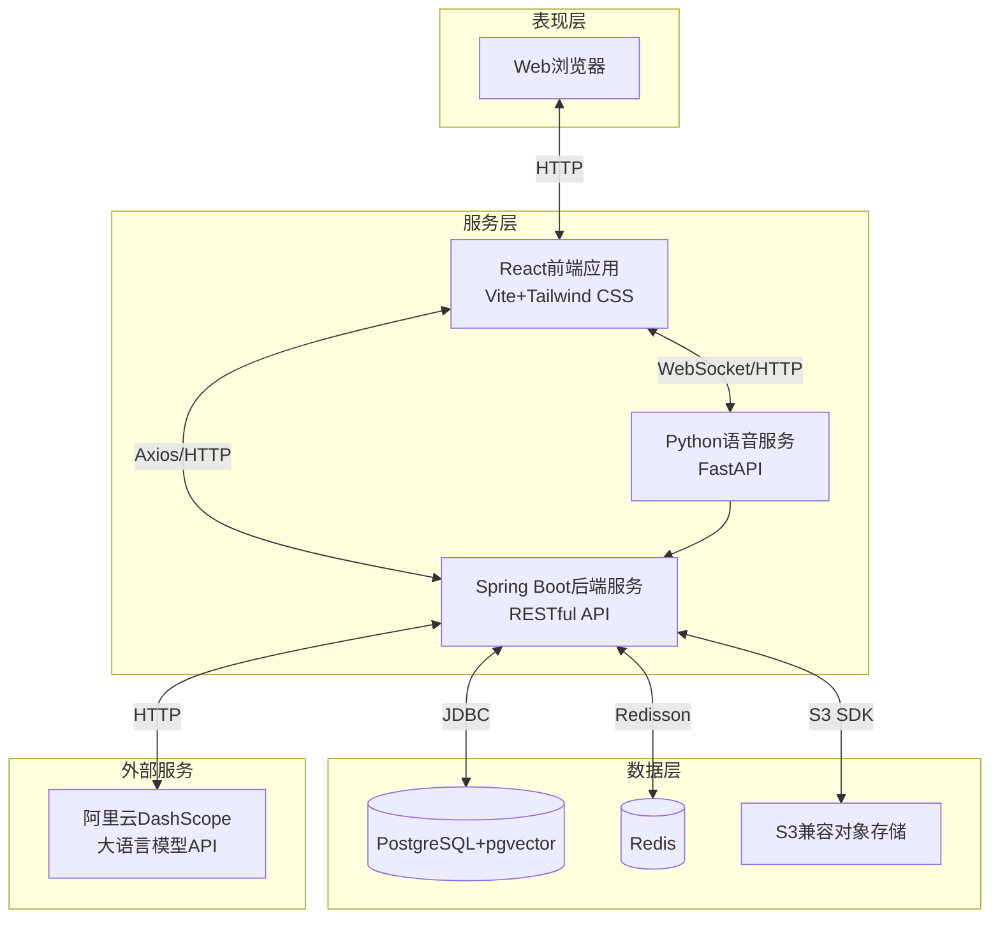
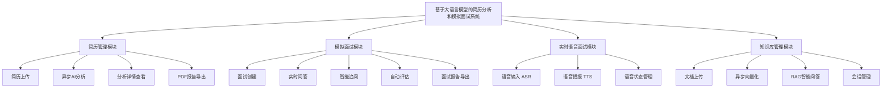
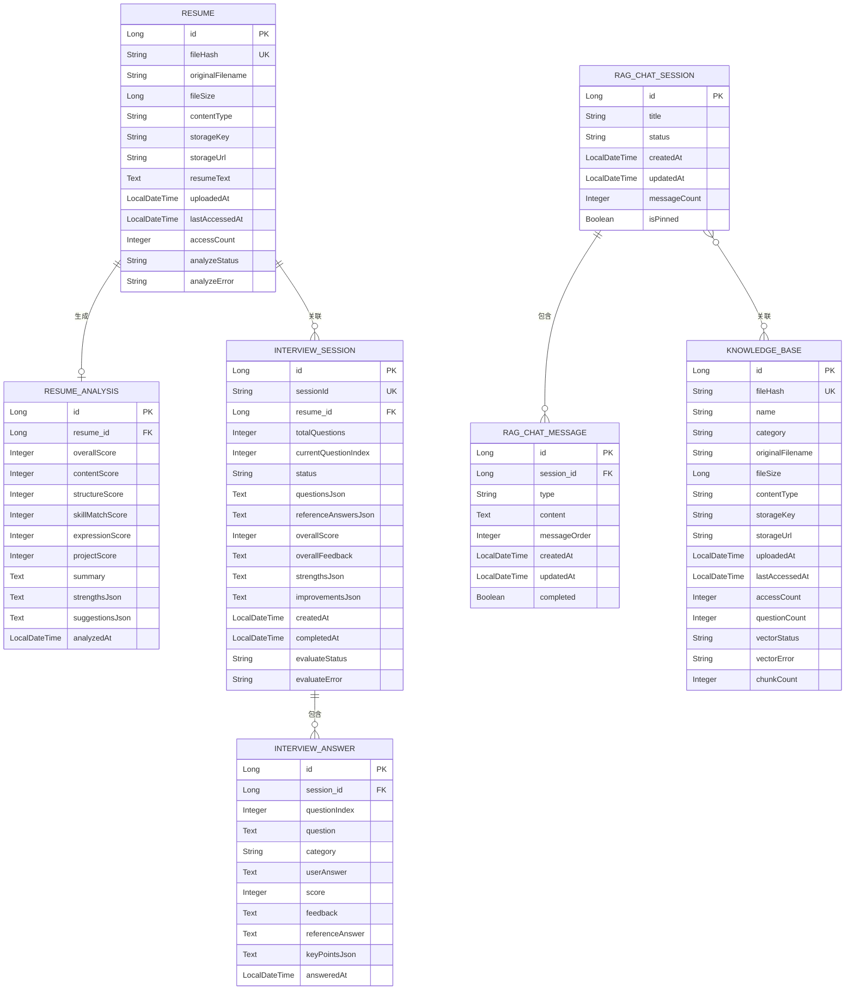
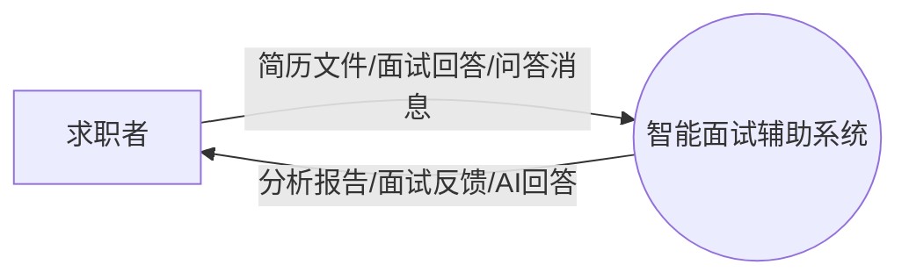
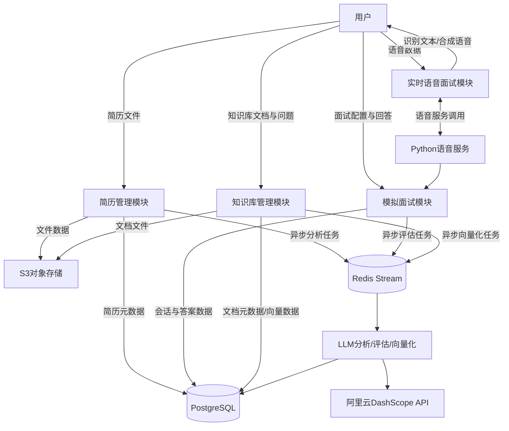

# 第3章 系统总体设计

## 3.1 软件系统结构设计

### 3.1.1 系统整体架构

系统采用B/S架构，用户用浏览器就能用全部功能，不用装额外的客户端。整体纵向分成数据层、服务层和表现层三块，层与层之间通过RESTful API、JDBC、S3 SDK这类标准接口打交道。这种分法的好处是：哪层要换技术栈，只要接口约定不动，对其它层的影响就能控制在最小范围内。系统整体架构如图1所示。

（1）**表现层**：直接面向用户，负责界面渲染和交互响应。前端基于React 18.3和TypeScript开发，靠组件化和虚拟DOM做局部更新，不用每次都刷整页。构建工具用Vite，依托浏览器原生ES模块按需编译，启动快，项目大了也不会慢下来。样式用Tailwind CSS，原子类直接写在HTML里，省去在样式文件和模板之间来回跳的麻烦。前后端通信主要走Axios发HTTP请求，知识库问答那块改用EventSource消费SSE流，字一个一个冒出来的效果就是这么来的。

（2）**服务层**：所有业务逻辑和外部服务调用都在这一层处理。服务层拆成两个独立部署的部分：主服务用Spring Boot和Java 21写，Spring AI框架负责统一对接大模型API，Spring Boot的自动配置和内嵌服务器省掉了大量模板化配置，服务搭起来和部署都快[15]。语音服务单独用Python FastAPI搞，里面集成了sherpa-onnx做中文语音识别、MeloTTS做中文语音合成——语音模型和Python生态绑得太深，硬塞进Java主服务里只会添乱，拆成独立微服务前端和主服务都通过HTTP接口来调用就好。胡荣等人的研究也表明，Spring Boot前后端分离的架构方式对开发效率和可维护性都有明显帮助[16]。

（3）**数据层**：全量数据的持久化和检索都在这里。数据库选了PostgreSQL，装上pgvector扩展后既能存关系型数据，也能存向量数据做相似度检索，RAG问答需要的高维向量查询就靠它。陈建海等人对微服务架构B/S系统的研究表明，合理的服务拆分配上负载均衡，并发处理能力能提升不少[19]。Redis在这里同时干两件事：一是缓存面试会话状态，比本地ConcurrentHashMap的好处是多实例部署时状态能共享；二是当消息队列用，基于Redis Stream调度简历解析、知识库向量化、面试报告生成这几个不能让用户等的耗时任务。用户上传的简历文件和知识库文档这类二进制数据单独放S3兼容对象存储（RustFS/MinIO），数据库只存元数据和路径，两类数据分开管。

（4）**外部服务层**：通过Spring AI框架接入阿里云DashScope的大模型API，默认用qwen-plus跑简历分析、面试题生成、回答评估和知识库问答这几块。API密钥管理、超时控制和异常重试都在后端统一封装，不暴露给前端。

### 3.1.2 系统功能结构

系统按需求分析结果划分为四个核心功能模块：简历管理、模拟面试、实时语音面试和知识库管理，另外还有上传组件、历史记录管理、评分可视化这些公共功能。系统功能结构如图2所示。

各模块说明如下：

（1）**简历管理模块**：处理简历上传、状态查看、AI分析结果展示和PDF导出。用户上传简历后，Apache Tika负责提取文档文本，经Redis Stream异步丢给LLM分析，最终生成内容完整性、结构清晰度、技能匹配度、表达专业性、项目经验五个维度的评分和改进建议。

（2）**模拟面试模块**：用户选好简历，系统根据简历内容生成个性化题目，不从通用题库随机抽。面试过程逐题推进，支持配置多轮追问，构建线性问答流。答完后对每道题评分反馈，汇总成总体评价并支持导出PDF。

（3）**实时语音面试模块**：模拟面试的语音增强版，把打字换成说话。集成ASR和TTS，用户语音输入实时转文字，面试问题和评估反馈也能语音播出来，交互自然度比纯文字好一些。

（4）**知识库管理模块**：用户上传专业文档建个人知识库，系统解析分块后异步向量化存进pgvector。用户发问时，系统做向量相似度检索召回相关片段，LLM基于这些片段生成回答，SSE流式推给前端。

## 3.2 系统数据分析

### 3.2.1 实体关系分析

整理业务需求后，系统识别出七个核心实体：简历（Resume）、简历分析结果（ResumeAnalysis）、面试会话（InterviewSession）、面试答案（InterviewAnswer）、知识库文档（KnowledgeBase）、RAG聊天会话（RagChatSession）、RAG聊天消息（RagChatMessage）。各实体属性和相互关系如图3所示。

各实体关系说明如下：

（1）**简历与简历分析结果**：一份简历分析完生成一条分析记录，一对一关系。ResumeEntity用analyzeStatus字段跟踪分析状态，ResumeAnalysisEntity通过resume_id外键关联。

（2）**简历与面试会话**：一份简历可以用来开多次模拟面试，一对多关系。InterviewSessionEntity通过resume_id外键关联ResumeEntity。

（3）**面试会话与面试答案**：一个面试会话包含多道题目和对应的用户回答，一对多关系。InterviewAnswerEntity通过session_id外键关联InterviewSessionEntity，questionIndex和session_id的组合唯一约束保证每道题只有一条回答记录。

（4）**RAG聊天会话与RAG聊天消息**：一个会话包含多条来回消息，一对多关系。RagChatMessageEntity通过session_id外键关联RagChatSessionEntity，messageOrder字段保证消息顺序。

（5）**RAG聊天会话与知识库文档**：一个会话可以关联多个知识库，一个知识库也可以被多个会话引用，多对多关系，通过中间表rag_session_knowledge_bases关联。

### 3.2.2 数据流图

系统顶层数据流图如图4所示，外部实体是使用系统备考面试的求职者，数据流主要有简历文件、面试数据、知识库文档和问答消息这几类。

将系统内部展开，得到0层数据流图，如图5所示。

各模块数据流说明如下：

（1）**简历管理模块**：用户上传简历后，文件元数据写resumes表，文件本身传S3。系统往Redis Stream发一条异步分析消息，消费者调LLM完成解析和评分，结果写resume_analyses表，同时更新resumes表的状态字段。

（2）**模拟面试模块**：创建面试后，配置和题目列表写interview_sessions表。用户每答一题，回答写进interview_answers表。面试结束后往Redis Stream发异步评估消息，消费者对每道回答调LLM评分，最终把总体评价和报告数据更新回interview_sessions表。

（3）**实时语音面试模块**：用户在前端对着麦克风说话，前端调Python语音服务的ASR接口拿到识别文本，文本送进模拟面试模块的答题流程。系统生成的回复文本通过TTS接口合成语音流，返回前端播放。

（4）**知识库管理模块**：用户上传文档后，元数据写knowledge_bases表，文件传S3。系统往Redis Stream发异步向量化消息，消费者把文档分块后调Embedding模型生成向量，存进pgvector的vector_store表。用户发起RAG问答时，先把问题向量化，pgvector检索出相关片段，再调LLM生成回答，SSE流式推回前端。

## 3.3 数据库设计

数据库选PostgreSQL，装pgvector扩展支持向量存储。表设计遵循第三范式，在查询频繁的字段上建了索引。以下是主要数据表的说明。

### 3.3.1 简历相关表

**resumes表**存用户上传的简历文件元数据，如表1所示。

表1 resumes表结构

| 字段名 | 数据类型 | 约束 | 说明 |
|:---|:---|:---|:---|
| id | BIGINT | PRIMARY KEY | 唯一标识 |
| file_hash | VARCHAR(64) | UNIQUE, NOT NULL | 文件SHA-256哈希，用于去重 |
| original_filename | VARCHAR(255) | NOT NULL | 原始文件名 |
| file_size | BIGINT | | 文件大小（字节） |
| content_type | VARCHAR(100) | | MIME类型 |
| storage_key | VARCHAR(500) | | S3存储Key |
| storage_url | VARCHAR(1000) | | S3访问URL |
| resume_text | TEXT | | 解析后的简历文本 |
| uploaded_at | TIMESTAMP | NOT NULL | 上传时间 |
| last_accessed_at | TIMESTAMP | | 最后访问时间 |
| access_count | INTEGER | DEFAULT 0 | 访问次数 |
| analyze_status | VARCHAR(20) | | 分析状态 |
| analyze_error | VARCHAR(500) | | 分析错误信息 |

**resume_analyses表**用于存储简历AI分析结果，如表2所示。

表2 resume_analyses表结构

| 字段名 | 数据类型 | 约束 | 说明 |
|:---|:---|:---|:---|
| id | BIGINT | PRIMARY KEY | 唯一标识 |
| resume_id | BIGINT | FOREIGN KEY, NOT NULL | 关联简历ID |
| overall_score | INTEGER | | 总分(0-100) |
| content_score | INTEGER | | 内容完整性(0-25) |
| structure_score | INTEGER | | 结构清晰度(0-20) |
| skill_match_score | INTEGER | | 技能匹配度(0-25) |
| expression_score | INTEGER | | 表达专业性(0-15) |
| project_score | INTEGER | | 项目经验(0-15) |
| summary | TEXT | | 简历摘要 |
| strengths_json | TEXT | | 优点列表(JSON) |
| suggestions_json | TEXT | | 改进建议列表(JSON) |
| analyzed_at | TIMESTAMP | NOT NULL | 分析时间 |

### 3.3.2 面试相关表

**interview_sessions表**用于存储模拟面试会话信息，如表3所示。

表3 interview_sessions表结构

| 字段名 | 数据类型 | 约束 | 说明 |
|:---|:---|:---|:---|
| id | BIGINT | PRIMARY KEY | 唯一标识 |
| session_id | VARCHAR(36) | UNIQUE, NOT NULL | 会话UUID |
| resume_id | BIGINT | FOREIGN KEY, NOT NULL | 关联简历ID |
| total_questions | INTEGER | | 题目总数 |
| current_question_index | INTEGER | DEFAULT 0 | 当前题目索引 |
| status | VARCHAR(20) | | 会话状态 |
| questions_json | TEXT | | 题目列表(JSON) |
| reference_answers_json | TEXT | | 参考答案列表(JSON) |
| overall_score | INTEGER | | 面试总分(0-100) |
| overall_feedback | TEXT | | 总体评价 |
| strengths_json | TEXT | | 优势分析(JSON) |
| improvements_json | TEXT | | 改进建议(JSON) |
| created_at | TIMESTAMP | NOT NULL | 创建时间 |
| completed_at | TIMESTAMP | | 完成时间 |
| evaluate_status | VARCHAR(20) | | 评估状态 |
| evaluate_error | VARCHAR(500) | | 评估错误信息 |

**interview_answers表**用于存储面试中每道题的用户回答与评估结果，如表4所示。

表4 interview_answers表结构

| 字段名 | 数据类型 | 约束 | 说明 |
|:---|:---|:---|:---|
| id | BIGINT | PRIMARY KEY | 唯一标识 |
| session_id | BIGINT | FOREIGN KEY, NOT NULL | 关联会话ID |
| question_index | INTEGER | | 题目索引 |
| question | TEXT | | 问题内容 |
| category | VARCHAR(100) | | 问题类别 |
| user_answer | TEXT | | 用户回答 |
| score | INTEGER | | 得分(0-100) |
| feedback | TEXT | | 反馈内容 |
| reference_answer | TEXT | | 参考答案 |
| key_points_json | TEXT | | 关键点(JSON) |
| answered_at | TIMESTAMP | NOT NULL | 回答时间 |

### 3.3.3 知识库相关表

**knowledge_bases表**用于存储知识库文档元数据，如表5所示。

表5 knowledge_bases表结构

| 字段名 | 数据类型 | 约束 | 说明 |
|:---|:---|:---|:---|
| id | BIGINT | PRIMARY KEY | 唯一标识 |
| file_hash | VARCHAR(64) | UNIQUE, NOT NULL | 文件哈希，用于去重 |
| name | VARCHAR(255) | NOT NULL | 知识库名称 |
| category | VARCHAR(100) | | 分类/分组 |
| original_filename | VARCHAR(255) | NOT NULL | 原始文件名 |
| file_size | BIGINT | | 文件大小 |
| content_type | VARCHAR(100) | | 文件类型 |
| storage_key | VARCHAR(500) | | S3存储Key |
| storage_url | VARCHAR(1000) | | S3访问URL |
| uploaded_at | TIMESTAMP | NOT NULL | 上传时间 |
| last_accessed_at | TIMESTAMP | | 最后访问时间 |
| access_count | INTEGER | DEFAULT 0 | 访问次数 |
| question_count | INTEGER | DEFAULT 0 | 提问次数 |
| vector_status | VARCHAR(20) | | 向量化状态 |
| vector_error | VARCHAR(500) | | 向量化错误信息 |
| chunk_count | INTEGER | DEFAULT 0 | 向量分块数量 |

**rag_chat_sessions表**用于存储RAG问答会话，如表6所示。

表6 rag_chat_sessions表结构

| 字段名 | 数据类型 | 约束 | 说明 |
|:---|:---|:---|:---|
| id | BIGINT | PRIMARY KEY | 唯一标识 |
| title | VARCHAR(255) | NOT NULL | 会话标题 |
| status | VARCHAR(20) | | 会话状态 |
| created_at | TIMESTAMP | NOT NULL | 创建时间 |
| updated_at | TIMESTAMP | | 更新时间 |
| message_count | INTEGER | DEFAULT 0 | 消息数量 |
| is_pinned | BOOLEAN | DEFAULT FALSE | 是否置顶 |

**rag_chat_messages表**用于存储RAG问答消息，如表7所示。

表7 rag_chat_messages表结构

| 字段名 | 数据类型 | 约束 | 说明 |
|:---|:---|:---|:---|
| id | BIGINT | PRIMARY KEY | 唯一标识 |
| session_id | BIGINT | FOREIGN KEY, NOT NULL | 关联会话ID |
| type | VARCHAR(20) | NOT NULL | 消息类型(USER/ASSISTANT) |
| content | TEXT | NOT NULL | 消息内容 |
| message_order | INTEGER | NOT NULL | 消息顺序 |
| created_at | TIMESTAMP | NOT NULL | 创建时间 |
| updated_at | TIMESTAMP | | 更新时间 |
| completed | BOOLEAN | DEFAULT TRUE | 是否完成 |

rag_session_knowledge_bases表是RAG会话与知识库的多对多关联中间表，session_id和knowledge_base_id两个外键共同构成复合主键。

另外，Spring AI框架第一次启动时会自动建vector_store表，用来存文档分块后的向量数据。表里有id、content、metadata、embedding四个字段，embedding字段是pgvector的vector类型，支持余弦相似度检索。

## 3.4 本章小结

本章完成了系统总体设计。先说清楚了B/S三层架构里表现层、服务层、数据层和外部服务层各自干什么、为什么这么选；然后用功能结构图展示了四大模块怎么拆；接着用E-R图和数据流图把简历、面试会话、知识库文档、RAG聊天会话这几个核心实体的关系理清楚，数据在各模块间怎么流转也说明白了；最后给出了主要数据表的字段设计。这些内容是第四章详细设计和实现的直接依据。
