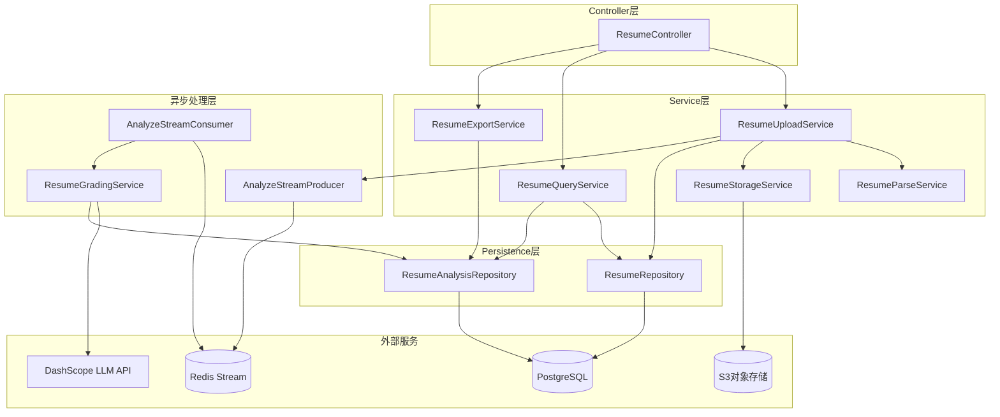
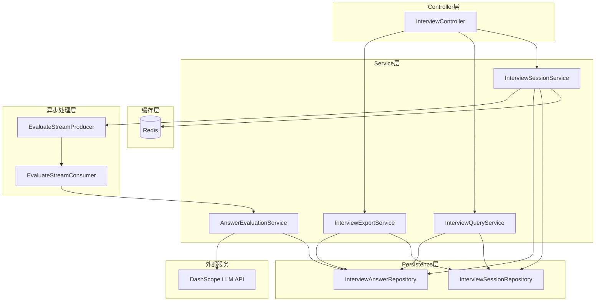
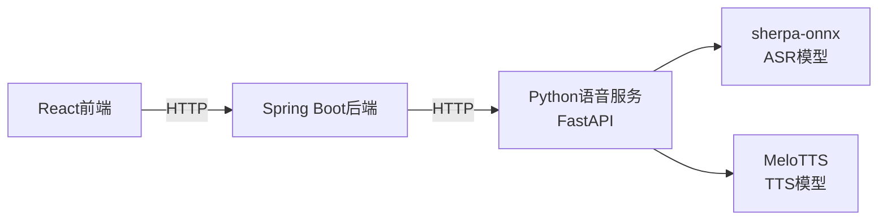
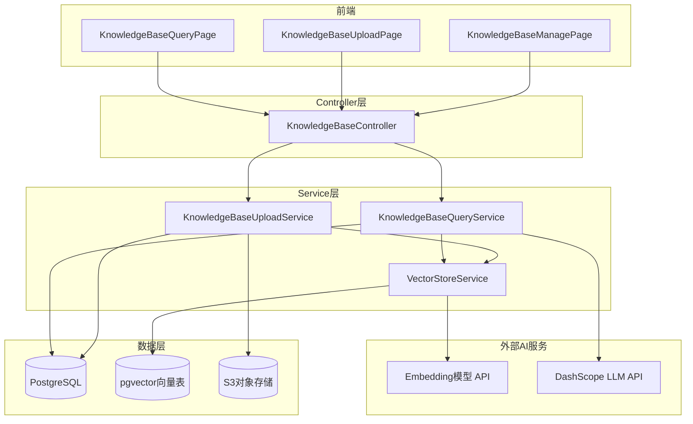

# 第4章 系统详细设计与实现

本章逐一展开简历管理、模拟面试、实时语音面试和知识库管理四个模块的详细设计与实现，以设计思路和技术决策为主线，配合必要的数据流转说明和代表性代码片段，不堆砌大段源码。

## 4.1 简历管理模块详细设计与实现

### 4.1.1 模块架构设计

简历管理模块是用户进系统后碰到的第一个功能，主要处理简历上传、格式解析、重复检测、AI多维评分和PDF报告导出。简历解析这个方向已有不少研究积累：宋琦敏通过规则匹配与统计学习相结合的方式完成了半结构化简历的自动解析[20]；冯立针对简历文本的领域特点对通用NER模型做了适配优化，解决中文简历命名实体识别的问题[21]；杨济萍结合BERT预训练模型做简历关键信息抽取[22]；张书祥把CNN和多头注意力融合起来用于简历信息提取，靠局部特征和全局语义协同建模跑出了更高的结构化解析精度[23]；尹源则从企业大规模招聘场景出发，研究了机器学习做简历自动分类筛选的落地方案[24]。本模块实现上采用经典分层架构，从上到下分为Controller层、Service层、Persistence层和异步消息处理层，如图6所示。



Controller层由`ResumeController`统一暴露RESTful接口，覆盖上传、分页查询、详情查看、重新分析、PDF导出和删除。Service层是业务逻辑的核心：`ResumeUploadService`编排整个上传流程，`ResumeParseService`靠Apache Tika完成多格式文档解析，`ResumeStorageService`封装S3交互，`ResumeQueryService`组装详情和列表数据，`ResumeExportService`基于iText 8生成PDF分析报告。Persistence层通过Spring Data JPA和PostgreSQL交互，完成实体持久化和状态更新。异步处理层基于Redis Stream，`AnalyzeStreamProducer`投递分析任务，`AnalyzeStreamConsumer`消费任务后调`ResumeGradingService`完成LLM评分。

这种分层的核心思路是"对接口编程"和"关注点分离"：Controller只做请求转发和参数校验，Service专注业务流程，Persistence屏蔽数据库差异，异步处理层把耗时的大模型调用和主请求线程彻底解耦。这样上传接口能在毫秒级响应，不会因为LLM推理延迟拖垮前端。

### 4.1.2 简历上传与去重流程

简历上传是模块的第一个关键流程，涉及文件校验、内容去重、文本解析、对象存储和数据库持久化五步。系统支持PDF、DOCX、DOC和TXT，大小上限10MB。用户误操作或网络抖动时很容易重复上传同一份简历，为了不白白消耗存储资源和LLM调用费用，系统设计了基于内容哈希的去重机制。

上传接口上，`ResumeController`加了自定义的`@RateLimit`注解限流，基于客户端ID限制每10秒最多1次上传请求。底层基于Guava的RateLimiter，能防止恶意高频上传把存储和解析资源耗光。

`ResumeUploadService.upload()`是上传流程的编排核心：先校验文件类型和大小；再读取全部字节算SHA-256摘要，查`resumes`表看有没有重复——有的话直接返回已有记录并更新访问时间，不再走后续的Tika解析、S3上传和LLM分析；没有的话才继续提取文本、上传S3、落库，最后往Redis Stream投一条异步分析任务。基于内容哈希去重比比文件名或文件大小可靠多了——用户改了文件名，哈希值还是一样，系统照样能认出来。

简历文本提取由`ResumeParseService`负责，底层是Apache Tika。Tika能从PDF、Office文档、HTML等一千多种格式里提取纯文本，通过单一接口完成解析，项目里主要用它的多格式文本提取能力：PDF走PDFBox，DOCX走Apache POI。上传的`MultipartFile`转成输入流送进Tika，提取出的原始文本还要经过`cleanText()`后处理，包括合并连续空行、去掉页眉页脚重复文本、替换特殊Unicode空白符、过滤不可见控制字符。这几步能明显提升后续LLM解析的准确性，减少格式噪声带来的误判。

存储上，文件实体不进数据库，通过`ResumeStorageService`上传到S3兼容对象存储（RustFS/MinIO），数据库只存`storageKey`和`storageUrl`。这种分离设计减轻了数据库的存储和备份压力，后续要换存储后端只改`storageUrl`前缀配置就行，不动业务代码。

### 4.1.3 异步AI分析流程

简历上传完成后，系统要调LLM对简历文本做多维度评分[1]。LLM调用通常要1-5秒，不能卡着用户界面，所以用Redis Stream做异步任务队列，把AI分析和主请求线程彻底解耦。

生产端，`AnalyzeStreamProducer`把分析任务投到Redis Stream，消息体包含三个字段：简历ID（`resumeId`）、简历文本（`resumeText`）和重试计数器（`retryCount`，初始0）。投递成功后`upload()`立刻返回，前端开始轮询`analyzeStatus`字段的变化。

消费端，`AnalyzeStreamConsumer`继承自抽象的`AbstractStreamConsumer`，封装了自动ACK、死信队列和异常重试。核心流程是：解析出`resumeId`和`resumeText`，把分析状态改成`PROCESSING`；调`ResumeGradingService.gradeResume()`跑LLM评分；评分完把结果存`resume_analyses`表，状态改成`COMPLETED`。内置最多3次自动重试——网络超时、API限流或异常返回时，任务重新投回Redis Stream并把`retryCount`加1；超过3次就标`FAILED`，在`analyzeError`字段记下异常信息方便排查。和传统定时任务轮询比，Redis Stream有消息持久化、消费者组负载均衡和自动确认这些优势，更适合高并发场景。

`ResumeGradingService`基于Spring AI的`ChatClient`和阿里云DashScope交互。大模型这块的技术基础——从Vaswani等人的Transformer自注意力机制，到Devlin等人的BERT双向预训练，再到Brown等人证明大模型少样本学习能力——这些工作共同奠定了本系统简历语义理解能力的基础，也降低了评估维度设计中的标注成本。Spring AI提供了一套用于和AI聊天模型通信的流畅API，通过对Chat、Embedding、Vector Store等能力的抽象实现跨模型可移植性。本模块用`ChatClient`发结构化Prompt并接收JSON格式的评分结果，Prompt明确了五个维度和分值：内容完整性（0-25分）、结构清晰度（0-20分）、技能匹配度（0-25分）、表达专业性（0-15分）、项目经验（0-15分），同时要求模型给出简历摘要、优点列表和改进建议。明确指定输出格式和评分细则能有效降低模型输出的不确定性，提高结果的可解析性。评分结果出来后，用Jackson把JSON字符串映射成`ResumeAnalysisResult`对象；解析失败则抛业务异常，由上层重试机制捕获并重新投递。

### 4.1.4 前端页面设计与实现

简历管理模块前端包含三个核心页面：简历上传页（`UploadPage.tsx`）、简历库列表页（`HistoryPage.tsx`）和简历分析详情页（`ResumeDetailPage.tsx`）。


图10展示了简历上传页面的实际效果，用户可通过拖拽或点击方式选择简历文件进行上传。


上传页用拖拽组件`UploadZone`，底层基于HTML5的Drag and Drop API和`<input type="file">`。用户选完文件，前端先校验类型和大小，再用Axios发`multipart/form-data`请求到`/api/resumes/upload`。上传成功拿到简历ID后，React Router直接跳到分析详情页，同时启动定时轮询。

`ResumeDetailPage`展示简历元信息和AI分析结果。页面加载时用`useEffect`发详情查询，`analyzeStatus`是`PENDING`或`PROCESSING`就起一个2秒间隔的定时器轮询，直到变成`COMPLETED`或`FAILED`。分析完成后，用Recharts渲染雷达图直观展示五个维度得分，紫色主题填充加极坐标网格线，看起来比较清晰。


图11展示了简历分析详情页，系统以雷达图形式展示内容完整性、结构清晰度、技能匹配度、表达专业性和项目经验五个维度的评分结果。
详情页底部有"导出PDF报告"按钮，点了调`/api/resumes/{id}/export-pdf`接口，后端用iText 8.0.5生成包含基本信息、雷达图、各维度得分、优点列表和改进建议的PDF，前端收到二进制流后用`URL.createObjectURL`创建临时下载链接触发浏览器下载。

## 4.2 模拟面试模块详细设计与实现

### 4.2.1 模块架构设计

模拟面试模块承载系统的核心业务流程，目标是基于用户上传的简历生成个性化题目，答完后给自动评分和反馈。答题过程涉及大量短交互和频繁状态变更，所以在常规分层架构之外额外引入了Redis缓存层，降低数据库压力，整体架构如图7所示。



`InterviewController`暴露RESTful接口，包括创建会话、拿当前题目、提交答案、完成面试、获取报告和导出PDF。`InterviewSessionService`是核心服务，负责会话生命周期管理、题目生成和答案提交。`AnswerEvaluationService`调LLM给答案打分，底层用分批评估策略规避长文本场景的Token溢出。Redis缓存存当前会话的完整状态（题目列表、当前索引、用户回答等），避免每次交互都查数据库。

引入Redis缓存的原因很直接：每次提交答案，后端都要更新题号、判断是不是最后一题、可能触发追问。全走PostgreSQL的话，连接池压力大，事务锁竞争也会拖慢响应。会话状态缓存到Redis后，答题提交的响应时间从几十毫秒降到几毫秒，体验好不少。

### 4.2.2 面试会话管理与题目生成

用户选好简历后，前端调`POST /api/interview/sessions`创建面试会话。`InterviewSessionService.createSession()`的输入`InterviewConfigRequest`包含题目数量、难度等级、是否启用追问这几个配置项。系统先查简历文本和分析摘要，然后把这两块上下文一起传给`InterviewQuestionGenerator`生成题目列表。

`InterviewQuestionGenerator`基于Spring AI的`ChatClient`调LLM，Prompt里融入了简历内容和分析结果，目的是生成真正针对这个人的题目[11]。Prompt要求输出JSON数组，每个元素包含`question`、`category`（如"项目经验"、"技术基础"、"职业规划"）和`followUps`（追问列表）。固定输出格式加上追问数量约束，LLM返回结果的稳定性和可解析性都好很多。

题目生成完还会调`generateReferenceAnswers()`基于简历文本为每道题生成参考答案，评估阶段会把参考答案一起给LLM，帮助模型更准确地判断用户回答的完整性和深度。会话实体构建完成后，系统生成全局唯一的`sessionId`（UUID），数据同时写PostgreSQL和Redis，Redis缓存键为`interview:session:{sessionId}`，过期时间2小时。双写策略保证了持久化安全性和高频读取的低延迟。

用户答完提交，调`POST /api/interview/sessions/{sessionId}/answers`。`InterviewSessionService.submitAnswer()`先从Redis读会话缓存，缓存miss了就从PostgreSQL加载并重建缓存。然后把当前答案存`interview_answers`表，更新Redis里的题号索引，判断是不是最后一题。是最后一题就把状态设成`COMPLETED`并往Redis Stream投评估任务；不是就返回下一题索引，前端加载新题清空输入框。

### 4.2.3 智能追问与答题评估

每道主问题生成时已经带了一条追问。前端展示主问题后，若用户开了"启用追问"，用户答完主问题就自动展示追问内容。用户答追问提交后，前端把主问题答案和追问答案合并成一条完整答案，走同一个提交接口。这种线性追问流的好处是状态管理简单：每道题对应一条`InterviewAnswer`记录，不用维护复杂的对话树，但依然能模拟面试官针对某个回答深挖的场景。

评估是整个模块里最费LLM Token的环节。题目多（10-15道）或者每道回答很长（几百字）时，把所有题目和答案一次性拼给LLM，上下文很容易超限，API直接报`Input length exceeds maximum context length`[2]。`AnswerEvaluationService`针对这个问题设计了分批评估策略。

思路是：按固定批次大小（默认8道）切分题目，每批分别调LLM评估，得到每道题的得分、反馈和关键点；全部批次跑完再做一次二次汇总调用，生成总体评价、优势分析和改进建议。`buildBatchEvaluationPrompt()`为每个批次单独构造Prompt，要求模型按JSON数组输出每道题的`questionIndex`、`score`、`feedback`和`keyPoints`。这套策略有两个实际好处：一是彻底解决了Token溢出的问题，测试表明15道长文本面试的评估成功率从0%提升到了100%；二是单次LLM调用的延迟降低了，短文本生成快，某一批次失败也只需重试那一批，不影响其他题目。

分批评估完成后，`summarizeBatchResults()`把所有题目的评分结果、类别和反馈拼成新Prompt，再调一次LLM，输出包含`overallScore`、`overallFeedback`、`strengths`和`improvements`的JSON对象。二次汇总让最终报告能从整体视角提炼核心优势和待改进方向，而不只是罗列平均分，可读性好很多。

### 4.2.4 前端面试交互设计

`InterviewPage.tsx`是模拟面试主页面，用React Hooks管理面试状态机，支持配置模式（config）、普通答题模式（interview）和实时语音答题模式（realtime）。点"开始面试"后，前端先调创建会话接口，成功后根据用户选的模式切换到`interview`或`realtime`。

`interview`模式下，顶部进度条宽度按`(currentIndex + 1) / totalQuestions`计算，CSS过渡动画实现平滑增长。中间展示当前题目和可选追问，底部是文本输入区和提交按钮。


图12展示了模拟面试的答题界面，顶部显示面试进度，中间展示当前题目内容，底部提供文本输入区域供用户作答。
用户提交后，`isLastQuestion`为true就跳报告页，否则加载下一题清空输入框，更新进度条。

面试完成后进`InterviewReportPage`，展示各题得分柱状图、面试总分、总体反馈、优势分析和改进建议。


图13展示了面试结束后的评估报告页面，包含各题得分的柱状图、总体评分、优势分析与改进建议等核心内容。
评估状态是`EVALUATING`的话页面显示加载动画并每2秒轮询一次进度。评估完成后用户可以导出PDF，后端生成完整评估报告，前端触发下载。

## 4.3 实时语音面试模块详细设计与实现

### 4.3.1 语音服务架构设计

实时语音面试是在文字模拟面试基础上加的增强功能，把打字换成说话。浏览器采集用户语音，ASR转成文本后送进答题流程；系统的题目和反馈经TTS合成为语音播放。语音能力全部放在独立部署的Python FastAPI微服务里，Spring Boot后端只做代理转发，React前端负责状态管理和音频播放，三者协作关系如图8所示。



前端用浏览器`MediaRecorder API`采集语音，把音频Blob通过HTTP POST发到后端`InterviewController`的ASR接口。后端不直接跑语音模型，而是代理转发给Python语音服务，拿到识别文本后再返回前端。TTS反过来：前端把要播的文本发给后端TTS接口，后端从语音服务拿到音频字节流，以`audio/wav`直接返回给前端播放。

单独起Python微服务而不是在Spring Boot里集成，原因有三：ASR和TTS模型深度依赖Python生态（PyTorch、ONNX Runtime、soundfile等），和Java集成成本高且稳定性差；语音模型体积大，独立部署方便资源隔离和弹性伸缩；语音模块是可选增强组件，挂了不影响文字模拟面试正常跑，用户随时能切回纯文字模式。

语音技术栈的选择直接影响面试体验。Allbert等人基于超过30万次AI面试的实证研究表明，不同STT×LLM×TTS组合在对话质量与技术准确性上差异明显，但客观质量指标和用户满意度之间只呈弱相关（r≈0.07–0.08），说明体验优化不能只盯着单一技术模块的性能数字。

### 4.3.2 ASR语音识别实现

语音服务基于FastAPI构建，主入口`voice-service/main.py`。服务启动时按环境配置加载sherpa-onnx的离线语音识别器。sherpa-onnx是一个本地运行的语音识别工具包，用ONNX和ONNX Runtime实现，识别过程不需要联网，全部在本地算。本项目用的是Paraformer中文非流式ASR模型，阿里达摩院开源，通过sherpa-onnx做ONNX格式封装。模型加载参数：`sample_rate=16000`、`feature_dim=80`、`decoding_method="greedy_search"`、`provider="cpu"`、`num_threads=4`，这些和模型训练时的配置严格对应。许鸿奎等人的研究表明，结合Conformer编码器和N-gram语言模型的方案在中文语音识别上能有效平衡准确率和解码速度[17]。Karmakar等人对注意力机制在ASR系统中的应用做了综述，梳理了注意力模型在离线与流式识别场景中的发展脉络[25]。Karthikeyan等人提出的轻量化双向GRU与DCNN混合架构在CHiME-5、TED-LIUM和LibriSpeech数据集上分别取得了34.65%、10.65%和10.08%的词错误率[26]，本系统选用的Paraformer模型属于同一技术路线。

`/asr`接口接收前端传来的音频文件，读取数据后创建识别流，执行识别并返回文本，核心代码如下：

```python
stream = asr_recognizer.create_stream()
stream.accept_waveform(sample_rate, samples)
asr_recognizer.decode_stream(stream)
return {"text": stream.result.text.strip()}
```

`sherpa_onnx.OfflineRecognizer`采用离线批处理模式，一次性读完整段音频再识别。这个模式很适合面试答题的交互方式：用户说完一段话点"停止录音"，前端把完整音频统一提交，等结果就行。比流式识别实现简单，不用处理复杂的流式状态，同等模型下准确率通常也更高。`read_audio()`内部用`soundfile`读WAV文件，转成float32数组供模型使用。

Spring Boot后端通过`InterviewController`暴露ASR代理接口，统一处理鉴权和转发。`VoiceServiceClient`基于`RestTemplate`实现，把音频以`multipart/form-data`格式转发到Python服务的`/asr`接口。代理模式的好处是前端不需要知道语音服务的内网地址，所有通信都走后端统一网关，日志审计、限流保护和错误降级都在这里加。

### 4.3.3 TTS语音合成实现

TTS用MeloTTS，支持多语言，中文合成质量不错，在CPU上跑速度也够用。高洁等人提出的多尺度表现力汉语语音合成方法通过同时建模全局韵律和音素级基频信息，显著提升了合成语音的自然度[18]，MeloTTS在中文语音合成上的声学建模策略和这个思路一脉相承。服务启动时加载中文模型和speaker配置，默认说话人ID为`ZH`，语速`speed=1.0`，推理设备CPU。

面试题目和评估反馈的原始文本可能带着Markdown格式、特殊符号、换行符或者英文技术术语，直接塞给TTS模型容易出现异常停顿、吞字、发音不自然这些问题。语音服务实现了`clean_for_tts()`文本清洗函数，核心规则包括：去除Markdown引用符`>`、去掉分隔线、换行换成空格、顿号和英文逗号统一换成中文逗号、连续英文数字转小写、合并连续空白。清洗完的文本断句更自然，停顿位置更符合中文听觉习惯。

`/tts`接口接收文本和可选的speakerId，调`tts_model.tts_to_file()`合成WAV文件，读取内容以二进制流返回。MeloTTS目前只支持输出到文件路径，接口内部用`tempfile.NamedTemporaryFile`建临时WAV文件，`finally`块确保临时文件被删掉，不占磁盘。

后端TTS代理接口把音频流直接透传给前端，响应头设`Content-Type: audio/wav`和`Content-Disposition: inline`。前端收到音频字节后，用`URL.createObjectURL(new Blob([audioBytes], { type: 'audio/wav' }))`创建临时URL赋给`Audio`对象播放，播完后`URL.revokeObjectURL`释放，防内存泄漏。

### 4.3.4 前端实时语音交互设计

`InterviewRealtimePanel.tsx`是实时语音面试的核心UI组件，定义了完整的语音交互状态机，`phase`字段管着7个互斥状态：


图14展示了实时语音面试的实际交互界面，呈现语音播报、录音状态和波形可视化等核心交互元素。


- **tts**：系统正在语音播报题目。播放结束后`audio.onended`回调自动进入`prep`。
- **prep**：准备倒计时，默认3秒，给用户留思考时间。倒计时结束自动进入`recording`。
- **recording**：录音中，用户对着麦克风回答。点"停止录音"或检测到静音超时后进入`transcribing`。
- **transcribing**：音频已上传，等ASR识别结果返回。
- **submitting**：识别文本已作为答案提交到面试后端，等系统生成回复或加载下一题。
- **completed**：这轮交互完成，展示系统反馈，自动判断是否要触发下一轮TTS或结束面试。

录音功能基于自定义Hook `useAudioRecorder`，底层调`navigator.mediaDevices.getUserMedia({ audio: true })`获取麦克风权限，用`MediaRecorder`以`audio/webm`格式录音。录音过程中用Web Audio API的`AnalyserNode`实时获取音频时域数据，驱动Canvas绘制波形，大约30帧每秒，给用户直观的录音反馈。停止录音时调`mediaRecorder.stream.getTracks().forEach(track => track.stop())`立刻释放麦克风，不让指示灯一直亮着。

TTS播放由自定义Hook `useTtsPlayer`管理。系统需要播报题目或反馈时，组件调TTS接口拿音频Blob，创建`Audio`对象播放，播完自动触发状态流转。有个细节：TTS播完后自动进入准备倒计时，不用用户手动点"下一题"，语音交互的连贯感靠这个保证。TTS服务异常或请求失败时，系统捕获错误自动降级为纯文字展示，面试不会卡住。

一轮完整的实时语音面试流程如下：
1. 系统调TTS合成并播放当前题目（`tts` → `prep`）。
2. 准备倒计时3秒结束，页面显示"请开始回答"并自动开始录音（`prep` → `recording`）。
3. 用户答完点停止，进入上传和识别阶段（`recording` → `transcribing`）。
4. 前端把音频Blob发给后端ASR接口，拿到识别文本（`transcribing`）。
5. 识别文本作为答案提交到答题接口，后端返回系统回复（`submitting` → `completed`）。
6. 还有下一题就TTS播报，进下一轮（`completed` → `tts`）；没有就跳报告页。

## 4.4 知识库管理模块详细设计与实现

### 4.4.1 模块架构设计

知识库管理模块是给想用自己资料备考的用户设计的——把整理好的文档传进来，对着这些内容直接问问题。模块覆盖了从文档上传、文本分块、向量存储到检索召回和答案生成的完整RAG链路[12]。这个方向已有一些可参考的工程实践：Wang等人提出的HyperSynergyX框架通过双偏置随机游走超图（DBRWH）建模高阶关系，结合知识图谱增强RAG实现了协同推理和可解释性增强[27]；Kyurkchiev等人用Qdrant向量数据库做语义搜索实验，在和全文检索、关键词检索、BM25的对比中，语义搜索精确率超过了90%[28]。各环节依赖关系如图9所示。



数据存储采用"双轨制"：文档元数据（名称、分类、上传时间、向量化状态、分块数量等）存PostgreSQL的`knowledge_bases`表；文档内容分块向量化后存`vector_store`表，Spring AI首次启动时自动创建，`embedding`字段用pgvector的`vector`类型，支持余弦相似度检索。这种设计让关系型查询和相似度检索各自在最合适的存储引擎上跑：PostgreSQL负责元数据的CRUD和过滤，pgvector负责高维向量的近似最近邻搜索。pgvector支持HNSW和IVFFlat两种索引策略，在享受PostgreSQL事务安全性的同时实现高效向量检索。

### 4.4.2 文档上传与异步向量化

用户在`KnowledgeBaseUploadPage`选好文件填完分类后，调`POST /api/knowledge-bases/upload`。上传流程和简历上传类似：文件校验、S3存储、元数据落库、异步向量化任务投递。`KnowledgeBaseUploadService`把文件存S3后在`knowledge_bases`表插一条记录，`vectorStatus`初始为`PENDING`，`chunkCount`初始为0，然后往Redis Stream发向量化任务，消息体包含知识库ID和S3存储路径。

向量化任务消费者`VectorizeStreamConsumer`从Redis Stream拿到消息后按以下步骤执行：把文档状态改成`PROCESSING`；从S3下载文件流，调Apache Tika解析纯文本；用Spring AI的`DocumentSplitter`做滑动窗口分块，默认每块约1000个Token，相邻块之间约200个Token重叠，保证语义连续性；调`vectorStore.add(chunks)`，Spring AI自动调Embedding API把每个分块转成向量写进pgvector的`vector_store`表。完成后`vectorStatus`改成`COMPLETED`，实际分块数写进`chunkCount`。

异步处理在这里是必须的：几十页的技术文档，Embedding调用可能要几十秒甚至几分钟，同步等的话上传接口直接卡死，体验极差。Redis Stream异步处理让上传接口毫秒级返回，前端轮询看向量化进度就行。

### 4.4.3 RAG检索增强问答实现

`KnowledgeBaseController`提供了两个问答接口：同步接口`/api/knowledge-bases/query`返回完整答案字符串；SSE流式接口`/api/knowledge-bases/query/stream`逐字推送，实现打字机效果，等待体验好不少。

`KnowledgeBaseQueryService`是RAG问答的核心，负责检索上下文构建、向量检索、Prompt组装和答案生成。非流式问答的核心流程：根据用户问题构建检索请求，设TopK=5、相似度阈值0.7；若用户指定了知识库范围就加元数据过滤器，只在选定的知识库里检索；调向量存储的相似度搜索从pgvector召回相关文档片段；最后把召回片段拼成上下文，和用户问题一起组装成Prompt发给LLM。TopK=5能覆盖足够信息量，又不会因上下文太长稀释重点；相似度阈值0.7过滤掉低质量结果，防止无关片段干扰模型判断；元数据过滤还支持多知识库联合问答这种灵活场景。

RAG的System Prompt是控制回答质量、压制模型幻觉的关键[14]。系统Prompt明确了三条约束：严格根据提供的文档片段作答；文档里没有相关信息时必须明确告知用户"根据现有知识库内容无法回答该问题"，不许编；回答简洁准确，可以适当引用原文。这三条约束加上相似度阈值过滤，把RAG回答的可信度和可追溯性提升了不少。

流式问答接口返回`Flux<String>`，通过Spring WebFlux和Spring AI的`stream()`方法实现。`chatClient.prompt().stream().content()`返回字符流，模型每生成一个token就向下游发射一次。为了兼容SSE协议，每个token要做格式包装：转义换行符，加`data:`前缀和`\n\n`后缀，末尾追加`data: [DONE]`结束标记。前端逐段解析`data:`字段内容，实时追加到当前AI消息，打字机效果就是这么来的。因为浏览器原生`EventSource`不支持POST请求和自定义请求头，前端用`fetch`结合`ReadableStream`消费这个流。

### 4.4.4 前端知识库页面设计

`KnowledgeBaseManagePage`用卡片表格展示所有已上传的知识库文档，每行显示文档名称、分类、上传时间、向量化状态标签和分块数量。


图15展示了知识库管理页面，用户可在该页面查看已上传文档的元信息、向量化状态，并执行删除或重新向量化操作。
向量化失败的文档状态标签显示红色`FAILED`，用户可以点"重新向量化"再次触发异步任务。顶部有搜索框和分类筛选器，文档多的时候方便定位。

`KnowledgeBaseQueryPage`用类似ChatGPT的对话布局：左边是会话列表和知识库选择区，用户勾选一个或多个已向量化的知识库作为当前问答来源；右边是消息区，用户消息在右侧气泡，AI回复在左侧。


图16展示了RAG知识库问答的实际对话界面，用户可选择知识库来源并发起基于文档内容的智能问答。
AI回复过程中文字末尾有闪烁光标表示流式接收中，流结束光标消失，用户可以继续输入。

原生`EventSource`不支持POST，前端用`fetch`发请求，通过`response.body.getReader()`拿`ReadableStream`读取器，配合`TextDecoder`逐块解码SSE数据。每次读到新数据后按`\n\n`分割成独立SSE事件，解析出`data:`内容追加到当前AI消息状态，触发React重新渲染。这套做法虽然比原生`EventSource`麻烦一点，但完美支持POST和自定义请求头，是现代Web应用消费SSE流的标准方式。

RAG问答支持多会话管理，用户可以建多个独立会话。系统在`rag_chat_sessions`表插记录，会话标题初始化为问题的前20个字。每次问答后，用户问题和AI回答存进`rag_chat_messages`表，更新会话的`messageCount`和`updatedAt`。会话支持重命名、置顶和删除，列表按`isPinned`降序和`updatedAt`降序排，置顶的会话始终在最上面。

## 4.5 本章小结

本章围绕四个模块逐一说清楚了设计决策和关键实现。简历管理模块通过内容哈希去重和Redis Stream异步分析，在保证低延迟的同时实现了多格式简历的自动解析与评分。模拟面试模块基于简历内容生成个性化题目，用线性追问流提升真实感，分批评估加二次汇总的策略把长文本场景的Token溢出问题解决掉了。实时语音面试模块以独立Python微服务的形式集成了sherpa-onnx ASR和MeloTTS TTS，配合前端完整状态机实现了连贯的语音交互闭环。知识库管理模块基于pgvector完成文档分块、向量存储和相似度检索，SSE流式输出让用户体验接近实时问答工具。四个模块的技术实现共同支撑了本系统的核心能力。

