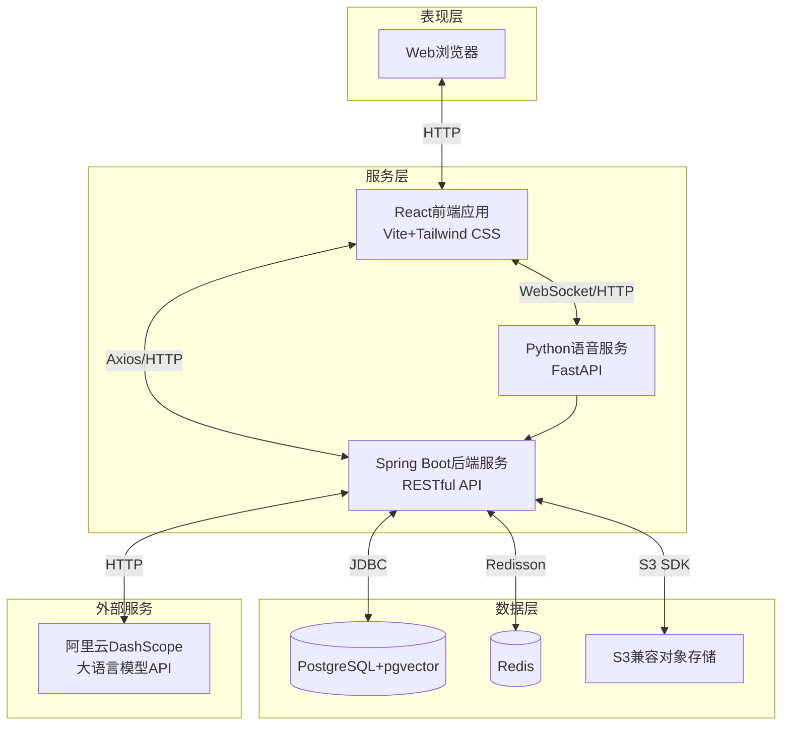
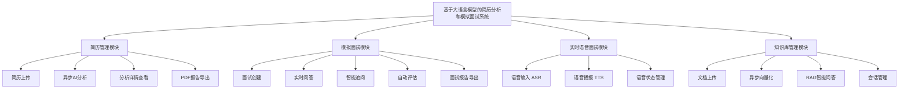
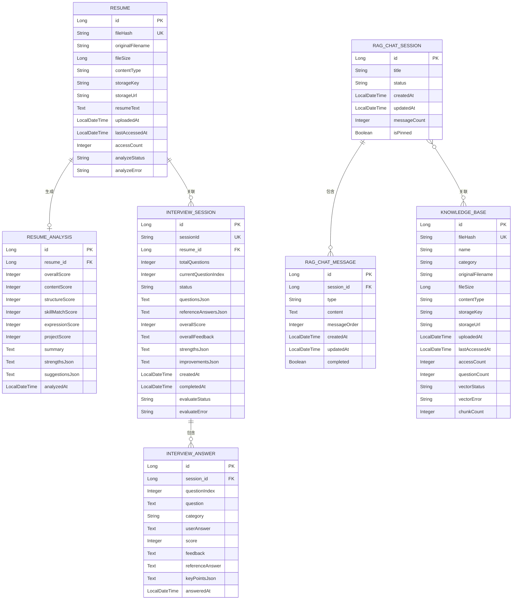
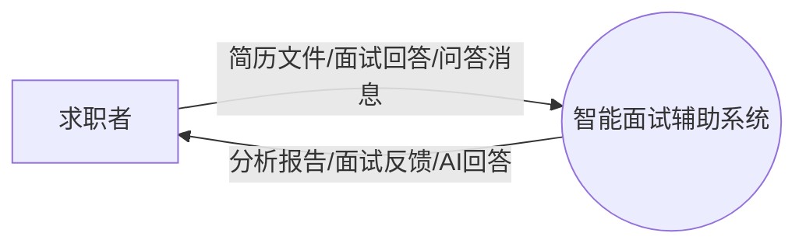
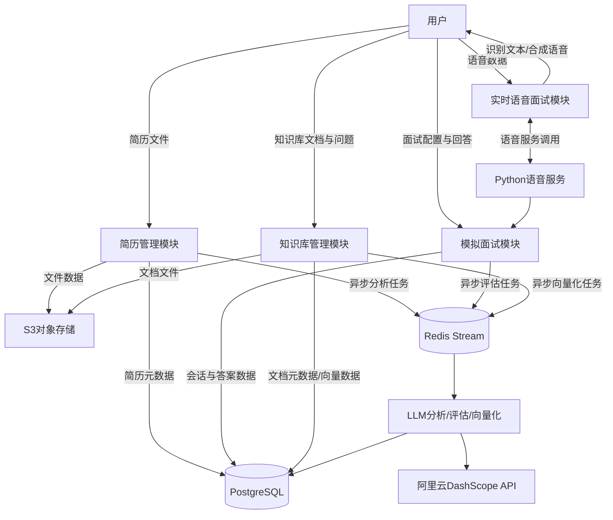
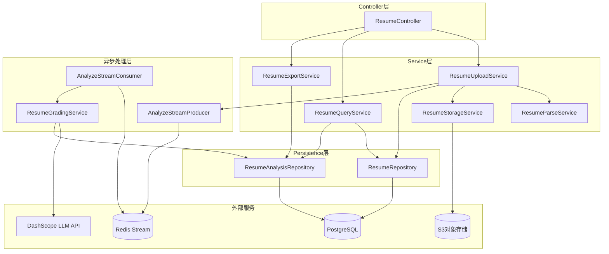
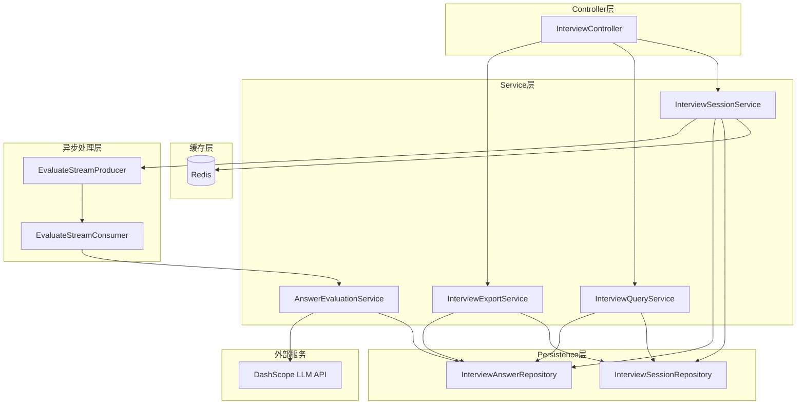
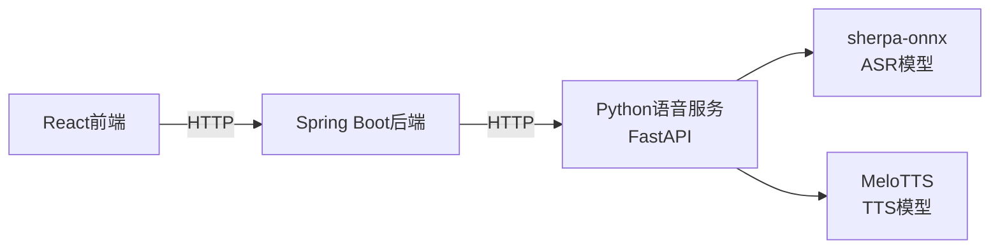
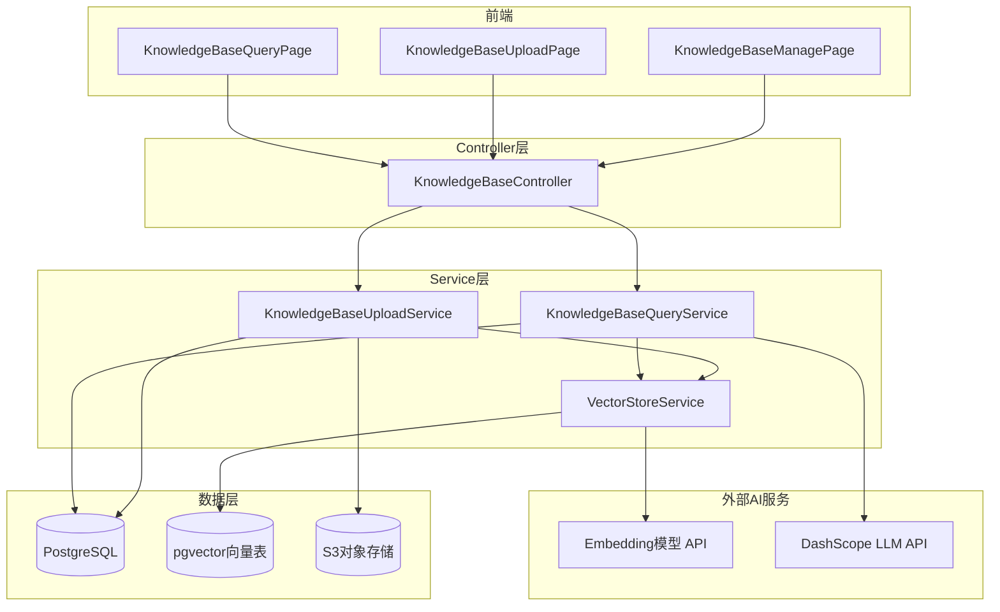

# 第1章 绪论

## 1.1 课题背景

随着数字经济这几年的高速扩张，企业的用人需求跟着水涨船高，HR部门每天要处理的简历少则几百份，多则上千份。艾瑞咨询的数据显示，2024年中国网络招聘市场规模已达183亿元，网络招聘渠道的占比稳定在七成上下。问题是，传统简历筛选几乎全靠HR的个人经验和当天的状态——看到第300份简历时，很难保证判断还和第1份一样准确，漏掉合适候选人几乎是必然。求职者那边也有自己的难处：大多数人在正式面试前根本没有针对性练习的机会，只能靠背题库碰运气。怎么让筛简历这件事变得更准、更快、更少受人为因素干扰，同时给求职者一个真正能练手的工具，已经是HR数字化绕不开的问题了。

大语言模型的出现，让这件事有了落地的可能。跟以前那些需要大量标注数据才能跑起来的模型不一样，LLM在样本极少甚至没有样本的情况下就能理解开放域文本[1]。赵凯博等人系统梳理了从BERT到DeepSeek的大模型技术演进路线，指出预训练语言模型通过自监督学习在海量无标注文本上获得的语义理解能力，已成为垂直领域智能化改造的核心驱动力[2]。刘梦瑶等人进一步总结了以大语言模型、多模态大模型和AI智能体为代表的大模型技术体系在垂直领域的落地路径，认为其在招聘、医疗、金融等知识密集型场景中具有显著的应用潜力[3]。借助这些能力，系统对着一份格式混乱的简历，也能把关键信息抽出来、给出多个维度的判断，还能说清楚为什么这么评。这正好戳中了招聘场景的痛点——HR不用再逐行盯着简历看，系统直接给结构化的评价结果；求职者也能根据自己简历的实际内容，得到有针对性的模拟题和反馈，而不是千篇一律的通用建议。

本课题设计并实现了基于大语言模型的简历分析和模拟面试系统（以下简称"本系统"），定位是帮求职者把面试准备这件事做得更系统一点。架构上选了B/S方案，后端主服务用Spring Boot + Java 21搭建，语音这块单独拆出来用Python FastAPI跑成一个微服务；前端用React 18.3和Vite。存储这边，PostgreSQL装上pgvector扩展之后同时扛关系型数据和向量数据，省去单独维护向量数据库的麻烦，Redis Stream则接手简历分析、面试评估、知识库向量化这几个不能让用户干等的任务，放到异步队列里慢慢跑。大模型能力通过Spring AI框架接入阿里云DashScope的API，最终落地了四个功能：简历智能解析、个性化模拟面试、实时语音交互、RAG知识库问答。

## 1.2 国内外研究现状及发展趋势

### 1.2.1 大语言模型在简历筛选领域的研究现状

大语言模型在人力资源领域的应用，大致经历了从关键词匹配到语义理解再到AI原生评估的几个阶段。早期简历筛选系统的核心是规则引擎，配合TF-IDF、BM25这类信息检索算法，本质上就是看候选人简历里有没有出现岗位要求的词。这种做法的局限很明显：遇到同义词、隐含语义或者跨领域的技能迁移，系统基本就"看不懂"了。

语义嵌入方向的突破来自Reimers与Gurevych提出的Sentence-BERT——通过孪生与三元组网络结构生成句子级语义向量，相似句对的检索时间从65小时压缩到了约5秒，同时没有明显损失BERT的准确率[4]。在招聘垂直场景里，Rosenberger等人的CareerBERT走得更远，把孪生网络和多负例排序损失结合起来，让简历和欧洲职业技能分类的职位描述共享同一个嵌入空间，人类专家评估的结果显示它比当时的主流嵌入方法表现更好[5]。Qin等人的TAPJFNN则换了个思路，引入主题感知机制，直接从历史招聘数据里学习岗位需求和求职者经历之间的语义映射，在人才搜索和岗位推荐两个子任务上都跑赢了基线[6]。

2024年前后，围绕大语言模型的简历筛选研究明显多了起来。应用层面，蒋欣奕梳理了当前企业招聘的几个老问题——周期长、人岗匹配差、人力成本压不下来——认为传统模式在数字化环境里已经力不从心，AI正在从简历筛选、面试评估这些环节切入，试图给出新的解法[7]。推荐系统方向，李家鹏把协同过滤和深度学习融合进在线招聘场景，用用户画像加岗位特征的组合来解决信息过载的问题[8]。Yang等人提出的POA-Apriori-MR-CNN混合方法在远程教育推荐场景里跑出了Recall@10=0.8896的成绩，侧面验证了深度学习做个性化推荐的可行性[9]。周崇钦的研究角度稍有不同，他从事业单位管理实践出发，主张同时构建人才画像和岗位画像，并强调这两个画像都要从硬实力和软实力两个维度持续更新，而不是建完就放着不动[10]。

不过有一点不能忽视：LLM简历筛选的公平性问题已经引起学术界注意，有研究指出开源语言模型对特定群体存在系统性偏见。这对本系统的后续迭代是个提醒——光盯着评估效率不够，还得定期跑公平性审计，并测试系统在对抗样本下的鲁棒性。

### 1.2.2 模拟面试与智能问答系统的研究现状

早期的模拟面试平台，核心逻辑其实很简单：维护一个题库，候选人进来答题，出去拿报告。不管你是应届生还是有五年经验的求职者，题目都一样，反馈也是同一套模板，很难让人觉得"这是为我准备的"。大语言模型的对话生成能力出现后，这个逻辑才开始被真正打破。陆苏于等人设计的"GEMINI+互感评估"工作流，用多智能体分工的方式把面试题生成、回答评估和反馈优化拆成独立模块来协作处理，整个系统的工程结构对后来想做类似产品的团队来说有不少可以直接借鉴的地方[11]。本系统后续计划把静态报告升级成可以来回对话的反思交互，这个架构思路是重要的参考之一。

工程层面，现在主流的AI面试系统基本都是几套技术叠在一起跑：自然语言处理负责理解文本，ASR把语音转成文字，TTS再把反馈念出来，有的还加了摄像头做表情分析。多模态融合这两年热度明显上来了，语音语调、文本语义、面部微表情三路信号合并评估的方案已经有团队在做。但说实话，现有系统对回答里的深层逻辑、上下文关联和一些比喻性表达还是经常"没读懂"，情感交互也还停留在比较机械的层面，距离真正自然的对话还有段距离。

### 1.2.3 RAG技术与知识库问答的研究进展

RAG的基本逻辑并不复杂：在让大语言模型开口回答之前，先去外部知识库里捞一遍相关内容塞进上下文，模型就不用全靠"记忆"作答，幻觉问题也能得到一定程度的抑制。袁乐等人在《计算机学报》的综述里给出了比较系统的效果总结——动态引入外部数据库信息之后，模型回答的准确性和可信度都有明显改善，尤其是在那些依赖最新领域知识的场景里提升更为突出[12]。李泽鸣等人的工作则把视野延伸到了多模态方向，他们梳理了MRAG在文档问答任务中的研究进展，指出传统RAG在图文混合、长文档和跨文档推理这几类场景里表现都不太好——检索机制过于依赖静态相似度匹配，遇到需要推理和生成的任务就容易掉链子，MRAG试图把检索的出发点从"找相似"换成"找有用"[13]。工程落地方面，包晓明做的私有化AI问答系统提供了一个可参考的实现思路：用Neo4j和MySQL分别管理不同类型的企业私有资源，在检索环节引入语义依存树来做意图理解，最终跑出的NDCG值稳定在0.85以上[14]。这几个方向的研究，对本系统知识库问答模块怎么设计、后续怎么迭代，都有直接的参考意义。

## 1.3 论文组织结构

全文共分六章。

第一章是绪论，从招聘行业当下面临的实际问题切入，说明为什么有必要把大语言模型引入简历分析和模拟面试这两个场景，并梳理国内外相关研究的现状和走向。

第二章做系统需求分析，围绕使用本系统备考面试的求职者展开，把简历管理、模拟面试、实时语音面试和知识库管理四个模块的功能需求逐一细化，同时从性能、可靠性、安全性、兼容性几个角度提出非功能层面的约束条件。

第三章是系统总体设计，给出B/S三层架构的整体方案，划清表现层、服务层和数据层各自的职责边界，借助功能结构图、E-R图和数据流图把核心实体关系和数据流转路径说清楚，附上主要数据表的详细设计。

第四章是系统详细设计与实现，也是全文篇幅最重的一章，按模块逐一展开：设计思路是什么、关键技术为什么这么选、有代表性的代码怎么写、前端页面的交互细节如何处理。

第五章是系统测试与分析，先介绍测试环境的软硬件配置，然后针对四大模块设计并执行功能测试用例，再通过接口响应、并发压力、长文本评估和向量检索四类性能测试，验证系统在实际负载下的稳定性和可用性。

第六章是总结与展望，回顾整个课题做了哪些工作，提炼出三个核心创新点，正视当前实现里存在的问题，最后对后续可能的改进方向做一些探讨。
# 第2章 系统需求分析

## 2.1 系统目标

本系统的定位是帮求职者把面试准备这件事做得更有针对性，核心是用大语言模型解决几个准备过程中绕不开的实际问题。系统需要达到以下目标：

（1）**简历解析与评估**：能读PDF、DOCX、DOC、TXT这几种常见格式，解析完用大语言模型生成多维度的结构化评估报告[1]，支持一键导出PDF。求职者看完报告应该能清楚知道自己简历哪里写得好、哪里得改。

（2）**个性化模拟面试**：题目不是从题库里随机抽的，而是根据候选人自己上传的简历内容生成，支持多轮追问，尽量还原真实面试的对话节奏。

（3）**语音交互**：集成ASR和TTS，用户可以直接开口答题、听系统反馈，不用一直盯着屏幕打字，面试练习的代入感会好一些。

（4）**知识库问答**：用户可以把自己的专业文档传进来建知识库，系统通过RAG技术在这些文档里检索再作答[12]，适合备考有明确知识点要考察的岗位。

（5）**稳定性与可扩展性**：B/S架构，Spring Boot后端，前后端通过RESTful API分离[15][16]。后端要能扛住一定并发，耗时任务走异步队列，前端在不同设备上显示不能乱掉，数据库层面有基本的安全保障。

## 2.2 系统功能需求

本系统面向使用本系统进行面试备考的求职者，按实际使用路径划分出简历管理、模拟面试、实时语音面试和知识库管理四个功能模块，以下逐一说明各模块的具体需求。

### 2.2.1 简历管理模块需求

简历管理是用户进入系统的第一步，也是模拟面试和知识库功能能跑起来的前提。用户可以上传PDF、DOCX、DOC或TXT格式的简历，系统在接收文件时校验类型和大小，同时用SHA-256内容哈希比对是否已有相同文件，重复的就不再重复解析和评分。上传完成后，文本提取和AI评分这两步不会卡着前端等，而是通过Redis Stream丢给后台消费者异步处理，任务状态在PENDING、PROCESSING、COMPLETED、FAILED之间自动流转，前端轮询拿进度就行。分析结果出来后，页面要展示总分以及内容完整性、结构清晰度、技能匹配度、表达专业性、项目经验五个子维度的得分，配上优点和改进建议。用户还可以一键把分析结果导出成PDF，历史上传记录支持查看、排序和删除。

### 2.2.2 模拟面试模块需求

这个模块想解决的问题是：练习题和你自己的简历对不上，练了也没太大用。用户选好一份简历后，系统根据里面的技术栈和项目经历自动生成一份带参考答案的题目列表，不是通用题库里随机抽的。答题时逐题推进，支持文字输入，开了语音服务的话也可以直接说。每道主题目可以带若干追问，用户答完主问题系统自动展示追问，主答案和追问答案合并存储，形成一条线性的问答记录[11]。所有题目答完后，系统调大语言模型对每道回答打0-100分并给出文字评价。考虑到多道题的回答加起来可能很长，评估这步拆成分批处理——按批次切分题目分别调用LLM评分，最后汇总成总体评价、优势分析和改进建议，不然Token很容易撑爆。面试结束后，用户可以把完整结果导出为PDF。

### 2.2.3 实时语音面试模块需求

实时语音面试本质上是模拟面试的另一种交互形式，把打字换成说话。模块需要同时接入ASR和TTS：用户对着麦克风说，ASR把音频转成文字再送进答题流程，结合Conformer编码器和N-gram语言模型的方案在中文识别任务上准确率和实时性的平衡还不错[17]；系统生成的题目和反馈则通过TTS合成语音播给用户，多尺度表现力合成方法在保持自然度的同时能对韵律和音素级基频做更细的控制[18]。前端这边要维护一套状态机，把TTS播报、准备倒计时、录音中、识别中、提交中、完成这几个阶段管清楚，每步切换都要有明确的UI提示，不然用户不知道现在轮到自己说话还是在等系统。

### 2.2.4 知识库管理模块需求

知识库模块是给那些备考有明确知识点的岗位的用户用的——把自己整理的资料传进来，然后直接对着这些文档问问题。支持PDF、DOCX和Markdown格式，上传后系统解析、分块、异步向量化，知识库列表里可以看到文档名称、分类、向量化状态和分块数量，支持删除和重新向量化。问答时，用户勾选一个或多个知识库作为上下文来源，系统做向量相似度检索召回Top-K相关片段，扔给LLM生成回答，结果通过SSE流式推回前端，字一个一个冒出来。会话管理上，用户可以建多个独立会话，历史消息随时翻，支持置顶或归档。

### 2.2.5 非功能需求

除功能需求外，系统还需要满足以下几类非功能约束：

- **性能**：简历解析、面试评估、知识库向量化这几个慢操作必须走异步，前端轮询进度；普通查询接口响应时间控制在500ms以内。
- **可靠性**：异步任务失败后自动重试，最多3次；数据库操作通过JPA统一事务管理，防止数据写到一半出岔子。
- **安全性**：用户上传的原始文件存对象存储，数据库只保留元数据；上传、创建面试这类写操作接口加限流保护。
- **兼容性**：前端响应式布局适配主流PC浏览器；语音服务独立部署，挂了不影响简历管理和文字模拟面试正常跑。

## 2.3 本章小结

本章先交代了系统面向求职者的建设目标，再按简历管理、模拟面试、实时语音面试、知识库管理四个模块逐一梳理功能需求，把文本/语音输入、异步处理、RAG问答、多会话管理这些关键能力落到了具体使用场景里。非功能部分从性能、可靠性、安全性、兼容性四个角度补了约束条件。这些内容是后续设计和实现的直接依据。
# 第3章 系统总体设计

## 3.1 软件系统结构设计

### 3.1.1 系统整体架构

系统采用B/S架构，用户用浏览器就能用全部功能，不用装额外的客户端。整体纵向分成数据层、服务层和表现层三块，层与层之间通过RESTful API、JDBC、S3 SDK这类标准接口打交道。这种分法的好处是：哪层要换技术栈，只要接口约定不动，对其它层的影响就能控制在最小范围内。系统整体架构如图1所示。


图1 系统整体架构

（1）**表现层**：直接面向用户，负责界面渲染和交互响应。前端基于React 18.3和TypeScript开发，靠组件化和虚拟DOM做局部更新，不用每次都刷整页。构建工具用Vite，依托浏览器原生ES模块按需编译，启动快，项目大了也不会慢下来。样式用Tailwind CSS，原子类直接写在HTML里，省去在样式文件和模板之间来回跳的麻烦。前后端通信主要走Axios发HTTP请求，知识库问答那块改用EventSource消费SSE流，字一个一个冒出来的效果就是这么来的。

（2）**服务层**：所有业务逻辑和外部服务调用都在这一层处理。服务层拆成两个独立部署的部分：主服务用Spring Boot和Java 21写，Spring AI框架负责统一对接大模型API，Spring Boot的自动配置和内嵌服务器省掉了大量模板化配置，服务搭起来和部署都快[15]。语音服务单独用Python FastAPI搞，里面集成了sherpa-onnx做中文语音识别、MeloTTS做中文语音合成——语音模型和Python生态绑得太深，硬塞进Java主服务里只会添乱，拆成独立微服务前端和主服务都通过HTTP接口来调用就好。胡荣等人的研究也表明，Spring Boot前后端分离的架构方式对开发效率和可维护性都有明显帮助[16]。

（3）**数据层**：全量数据的持久化和检索都在这里。数据库选了PostgreSQL，装上pgvector扩展后既能存关系型数据，也能存向量数据做相似度检索，RAG问答需要的高维向量查询就靠它。陈建海等人对微服务架构B/S系统的研究表明，合理的服务拆分配上负载均衡，并发处理能力能提升不少[19]。Redis在这里同时干两件事：一是缓存面试会话状态，比本地ConcurrentHashMap的好处是多实例部署时状态能共享；二是当消息队列用，基于Redis Stream调度简历解析、知识库向量化、面试报告生成这几个不能让用户等的耗时任务。用户上传的简历文件和知识库文档这类二进制数据单独放S3兼容对象存储（RustFS/MinIO），数据库只存元数据和路径，两类数据分开管。

（4）**外部服务层**：通过Spring AI框架接入阿里云DashScope的大模型API，默认用qwen-plus跑简历分析、面试题生成、回答评估和知识库问答这几块。API密钥管理、超时控制和异常重试都在后端统一封装，不暴露给前端。

### 3.1.2 系统功能结构

系统按需求分析结果划分为四个核心功能模块：简历管理、模拟面试、实时语音面试和知识库管理，另外还有上传组件、历史记录管理、评分可视化这些公共功能。系统功能结构如图2所示。


图2 系统功能结构

各模块说明如下：

（1）**简历管理模块**：处理简历上传、状态查看、AI分析结果展示和PDF导出。用户上传简历后，Apache Tika负责提取文档文本，经Redis Stream异步丢给LLM分析，最终生成内容完整性、结构清晰度、技能匹配度、表达专业性、项目经验五个维度的评分和改进建议。

（2）**模拟面试模块**：用户选好简历，系统根据简历内容生成个性化题目，不从通用题库随机抽。面试过程逐题推进，支持配置多轮追问，构建线性问答流。答完后对每道题评分反馈，汇总成总体评价并支持导出PDF。

（3）**实时语音面试模块**：模拟面试的语音增强版，把打字换成说话。集成ASR和TTS，用户语音输入实时转文字，面试问题和评估反馈也能语音播出来，交互自然度比纯文字好一些。

（4）**知识库管理模块**：用户上传专业文档建个人知识库，系统解析分块后异步向量化存进pgvector。用户发问时，系统做向量相似度检索召回相关片段，LLM基于这些片段生成回答，SSE流式推给前端。

## 3.2 系统数据分析

### 3.2.1 实体关系分析

整理业务需求后，系统识别出七个核心实体：简历（Resume）、简历分析结果（ResumeAnalysis）、面试会话（InterviewSession）、面试答案（InterviewAnswer）、知识库文档（KnowledgeBase）、RAG聊天会话（RagChatSession）、RAG聊天消息（RagChatMessage）。各实体属性和相互关系如图3所示。


图3 实体关系图

各实体关系说明如下：

（1）**简历与简历分析结果**：一份简历分析完生成一条分析记录，一对一关系。ResumeEntity用analyzeStatus字段跟踪分析状态，ResumeAnalysisEntity通过resume_id外键关联。

（2）**简历与面试会话**：一份简历可以用来开多次模拟面试，一对多关系。InterviewSessionEntity通过resume_id外键关联ResumeEntity。

（3）**面试会话与面试答案**：一个面试会话包含多道题目和对应的用户回答，一对多关系。InterviewAnswerEntity通过session_id外键关联InterviewSessionEntity，questionIndex和session_id的组合唯一约束保证每道题只有一条回答记录。

（4）**RAG聊天会话与RAG聊天消息**：一个会话包含多条来回消息，一对多关系。RagChatMessageEntity通过session_id外键关联RagChatSessionEntity，messageOrder字段保证消息顺序。

（5）**RAG聊天会话与知识库文档**：一个会话可以关联多个知识库，一个知识库也可以被多个会话引用，多对多关系，通过中间表rag_session_knowledge_bases关联。

### 3.2.2 数据流图

系统顶层数据流图如图4所示，外部实体是使用系统备考面试的求职者，数据流主要有简历文件、面试数据、知识库文档和问答消息这几类。


图4 顶层数据流图

将系统内部展开，得到0层数据流图，如图5所示。


图5 0层数据流图

各模块数据流说明如下：

（1）**简历管理模块**：用户上传简历后，文件元数据写resumes表，文件本身传S3。系统往Redis Stream发一条异步分析消息，消费者调LLM完成解析和评分，结果写resume_analyses表，同时更新resumes表的状态字段。

（2）**模拟面试模块**：创建面试后，配置和题目列表写interview_sessions表。用户每答一题，回答写进interview_answers表。面试结束后往Redis Stream发异步评估消息，消费者对每道回答调LLM评分，最终把总体评价和报告数据更新回interview_sessions表。

（3）**实时语音面试模块**：用户在前端对着麦克风说话，前端调Python语音服务的ASR接口拿到识别文本，文本送进模拟面试模块的答题流程。系统生成的回复文本通过TTS接口合成语音流，返回前端播放。

（4）**知识库管理模块**：用户上传文档后，元数据写knowledge_bases表，文件传S3。系统往Redis Stream发异步向量化消息，消费者把文档分块后调Embedding模型生成向量，存进pgvector的vector_store表。用户发起RAG问答时，先把问题向量化，pgvector检索出相关片段，再调LLM生成回答，SSE流式推回前端。

## 3.3 数据库设计

数据库选PostgreSQL，装pgvector扩展支持向量存储。表设计遵循第三范式，在查询频繁的字段上建了索引。以下是主要数据表的说明。

### 3.3.1 简历相关表

**resumes表**存用户上传的简历文件元数据，如表1所示。

表1 resumes表结构

| 字段名 | 数据类型 | 约束 | 说明 |
|:---|:---|:---|:---|
| id | BIGINT | PRIMARY KEY | 唯一标识 |
| file_hash | VARCHAR(64) | UNIQUE, NOT NULL | 文件SHA-256哈希，用于去重 |
| original_filename | VARCHAR(255) | NOT NULL | 原始文件名 |
| file_size | BIGINT | | 文件大小（字节） |
| content_type | VARCHAR(100) | | MIME类型 |
| storage_key | VARCHAR(500) | | S3存储Key |
| storage_url | VARCHAR(1000) | | S3访问URL |
| resume_text | TEXT | | 解析后的简历文本 |
| uploaded_at | TIMESTAMP | NOT NULL | 上传时间 |
| last_accessed_at | TIMESTAMP | | 最后访问时间 |
| access_count | INTEGER | DEFAULT 0 | 访问次数 |
| analyze_status | VARCHAR(20) | | 分析状态 |
| analyze_error | VARCHAR(500) | | 分析错误信息 |

**resume_analyses表**用于存储简历AI分析结果，如表2所示。

表2 resume_analyses表结构

| 字段名 | 数据类型 | 约束 | 说明 |
|:---|:---|:---|:---|
| id | BIGINT | PRIMARY KEY | 唯一标识 |
| resume_id | BIGINT | FOREIGN KEY, NOT NULL | 关联简历ID |
| overall_score | INTEGER | | 总分(0-100) |
| content_score | INTEGER | | 内容完整性(0-25) |
| structure_score | INTEGER | | 结构清晰度(0-20) |
| skill_match_score | INTEGER | | 技能匹配度(0-25) |
| expression_score | INTEGER | | 表达专业性(0-15) |
| project_score | INTEGER | | 项目经验(0-15) |
| summary | TEXT | | 简历摘要 |
| strengths_json | TEXT | | 优点列表(JSON) |
| suggestions_json | TEXT | | 改进建议列表(JSON) |
| analyzed_at | TIMESTAMP | NOT NULL | 分析时间 |

### 3.3.2 面试相关表

**interview_sessions表**用于存储模拟面试会话信息，如表3所示。

表3 interview_sessions表结构

| 字段名 | 数据类型 | 约束 | 说明 |
|:---|:---|:---|:---|
| id | BIGINT | PRIMARY KEY | 唯一标识 |
| session_id | VARCHAR(36) | UNIQUE, NOT NULL | 会话UUID |
| resume_id | BIGINT | FOREIGN KEY, NOT NULL | 关联简历ID |
| total_questions | INTEGER | | 题目总数 |
| current_question_index | INTEGER | DEFAULT 0 | 当前题目索引 |
| status | VARCHAR(20) | | 会话状态 |
| questions_json | TEXT | | 题目列表(JSON) |
| reference_answers_json | TEXT | | 参考答案列表(JSON) |
| overall_score | INTEGER | | 面试总分(0-100) |
| overall_feedback | TEXT | | 总体评价 |
| strengths_json | TEXT | | 优势分析(JSON) |
| improvements_json | TEXT | | 改进建议(JSON) |
| created_at | TIMESTAMP | NOT NULL | 创建时间 |
| completed_at | TIMESTAMP | | 完成时间 |
| evaluate_status | VARCHAR(20) | | 评估状态 |
| evaluate_error | VARCHAR(500) | | 评估错误信息 |

**interview_answers表**用于存储面试中每道题的用户回答与评估结果，如表4所示。

表4 interview_answers表结构

| 字段名 | 数据类型 | 约束 | 说明 |
|:---|:---|:---|:---|
| id | BIGINT | PRIMARY KEY | 唯一标识 |
| session_id | BIGINT | FOREIGN KEY, NOT NULL | 关联会话ID |
| question_index | INTEGER | | 题目索引 |
| question | TEXT | | 问题内容 |
| category | VARCHAR(100) | | 问题类别 |
| user_answer | TEXT | | 用户回答 |
| score | INTEGER | | 得分(0-100) |
| feedback | TEXT | | 反馈内容 |
| reference_answer | TEXT | | 参考答案 |
| key_points_json | TEXT | | 关键点(JSON) |
| answered_at | TIMESTAMP | NOT NULL | 回答时间 |

### 3.3.3 知识库相关表

**knowledge_bases表**用于存储知识库文档元数据，如表5所示。

表5 knowledge_bases表结构

| 字段名 | 数据类型 | 约束 | 说明 |
|:---|:---|:---|:---|
| id | BIGINT | PRIMARY KEY | 唯一标识 |
| file_hash | VARCHAR(64) | UNIQUE, NOT NULL | 文件哈希，用于去重 |
| name | VARCHAR(255) | NOT NULL | 知识库名称 |
| category | VARCHAR(100) | | 分类/分组 |
| original_filename | VARCHAR(255) | NOT NULL | 原始文件名 |
| file_size | BIGINT | | 文件大小 |
| content_type | VARCHAR(100) | | 文件类型 |
| storage_key | VARCHAR(500) | | S3存储Key |
| storage_url | VARCHAR(1000) | | S3访问URL |
| uploaded_at | TIMESTAMP | NOT NULL | 上传时间 |
| last_accessed_at | TIMESTAMP | | 最后访问时间 |
| access_count | INTEGER | DEFAULT 0 | 访问次数 |
| question_count | INTEGER | DEFAULT 0 | 提问次数 |
| vector_status | VARCHAR(20) | | 向量化状态 |
| vector_error | VARCHAR(500) | | 向量化错误信息 |
| chunk_count | INTEGER | DEFAULT 0 | 向量分块数量 |

**rag_chat_sessions表**用于存储RAG问答会话，如表6所示。

表6 rag_chat_sessions表结构

| 字段名 | 数据类型 | 约束 | 说明 |
|:---|:---|:---|:---|
| id | BIGINT | PRIMARY KEY | 唯一标识 |
| title | VARCHAR(255) | NOT NULL | 会话标题 |
| status | VARCHAR(20) | | 会话状态 |
| created_at | TIMESTAMP | NOT NULL | 创建时间 |
| updated_at | TIMESTAMP | | 更新时间 |
| message_count | INTEGER | DEFAULT 0 | 消息数量 |
| is_pinned | BOOLEAN | DEFAULT FALSE | 是否置顶 |

**rag_chat_messages表**用于存储RAG问答消息，如表7所示。

表7 rag_chat_messages表结构

| 字段名 | 数据类型 | 约束 | 说明 |
|:---|:---|:---|:---|
| id | BIGINT | PRIMARY KEY | 唯一标识 |
| session_id | BIGINT | FOREIGN KEY, NOT NULL | 关联会话ID |
| type | VARCHAR(20) | NOT NULL | 消息类型(USER/ASSISTANT) |
| content | TEXT | NOT NULL | 消息内容 |
| message_order | INTEGER | NOT NULL | 消息顺序 |
| created_at | TIMESTAMP | NOT NULL | 创建时间 |
| updated_at | TIMESTAMP | | 更新时间 |
| completed | BOOLEAN | DEFAULT TRUE | 是否完成 |

rag_session_knowledge_bases表是RAG会话与知识库的多对多关联中间表，session_id和knowledge_base_id两个外键共同构成复合主键。

另外，Spring AI框架第一次启动时会自动建vector_store表，用来存文档分块后的向量数据。表里有id、content、metadata、embedding四个字段，embedding字段是pgvector的vector类型，支持余弦相似度检索。

## 3.4 本章小结

本章完成了系统总体设计。先说清楚了B/S三层架构里表现层、服务层、数据层和外部服务层各自干什么、为什么这么选；然后用功能结构图展示了四大模块怎么拆；接着用E-R图和数据流图把简历、面试会话、知识库文档、RAG聊天会话这几个核心实体的关系理清楚，数据在各模块间怎么流转也说明白了；最后给出了主要数据表的字段设计。这些内容是第四章详细设计和实现的直接依据。
# 第4章 系统详细设计与实现

本章逐一展开简历管理、模拟面试、实时语音面试和知识库管理四个模块的详细设计与实现，以设计思路和技术决策为主线，配合必要的数据流转说明和代表性代码片段，不堆砌大段源码。

## 4.1 简历管理模块详细设计与实现

### 4.1.1 模块架构设计

简历管理模块是用户进系统后碰到的第一个功能，主要处理简历上传、格式解析、重复检测、AI多维评分和PDF报告导出。简历解析这个方向已有不少研究积累：宋琦敏通过规则匹配与统计学习相结合的方式完成了半结构化简历的自动解析[20]；冯立针对简历文本的领域特点对通用NER模型做了适配优化，解决中文简历命名实体识别的问题[21]；杨济萍结合BERT预训练模型做简历关键信息抽取[22]；张书祥把CNN和多头注意力融合起来用于简历信息提取，靠局部特征和全局语义协同建模跑出了更高的结构化解析精度[23]；尹源则从企业大规模招聘场景出发，研究了机器学习做简历自动分类筛选的落地方案[24]。本模块实现上采用经典分层架构，从上到下分为Controller层、Service层、Persistence层和异步消息处理层，如图6所示。


图6 简历管理模块分层架构

Controller层由`ResumeController`统一暴露RESTful接口，覆盖上传、分页查询、详情查看、重新分析、PDF导出和删除。Service层是业务逻辑的核心：`ResumeUploadService`编排整个上传流程，`ResumeParseService`靠Apache Tika完成多格式文档解析，`ResumeStorageService`封装S3交互，`ResumeQueryService`组装详情和列表数据，`ResumeExportService`基于iText 8生成PDF分析报告。Persistence层通过Spring Data JPA和PostgreSQL交互，完成实体持久化和状态更新。异步处理层基于Redis Stream，`AnalyzeStreamProducer`投递分析任务，`AnalyzeStreamConsumer`消费任务后调`ResumeGradingService`完成LLM评分。

这种分层的核心思路是"对接口编程"和"关注点分离"：Controller只做请求转发和参数校验，Service专注业务流程，Persistence屏蔽数据库差异，异步处理层把耗时的大模型调用和主请求线程彻底解耦。这样上传接口能在毫秒级响应，不会因为LLM推理延迟拖垮前端。

### 4.1.2 简历上传与去重流程

简历上传是模块的第一个关键流程，涉及文件校验、内容去重、文本解析、对象存储和数据库持久化五步。系统支持PDF、DOCX、DOC和TXT，大小上限10MB。用户误操作或网络抖动时很容易重复上传同一份简历，为了不白白消耗存储资源和LLM调用费用，系统设计了基于内容哈希的去重机制。

上传接口上，`ResumeController`加了自定义的`@RateLimit`注解限流，基于客户端ID限制每10秒最多1次上传请求。底层基于Guava的RateLimiter，能防止恶意高频上传把存储和解析资源耗光。

`ResumeUploadService.upload()`是上传流程的编排核心：先校验文件类型和大小；再读取全部字节算SHA-256摘要，查`resumes`表看有没有重复——有的话直接返回已有记录并更新访问时间，不再走后续的Tika解析、S3上传和LLM分析；没有的话才继续提取文本、上传S3、落库，最后往Redis Stream投一条异步分析任务。基于内容哈希去重比比文件名或文件大小可靠多了——用户改了文件名，哈希值还是一样，系统照样能认出来。

简历文本提取由`ResumeParseService`负责，底层是Apache Tika。Tika能从PDF、Office文档、HTML等一千多种格式里提取纯文本，通过单一接口完成解析，项目里主要用它的多格式文本提取能力：PDF走PDFBox，DOCX走Apache POI。上传的`MultipartFile`转成输入流送进Tika，提取出的原始文本还要经过`cleanText()`后处理，包括合并连续空行、去掉页眉页脚重复文本、替换特殊Unicode空白符、过滤不可见控制字符。这几步能明显提升后续LLM解析的准确性，减少格式噪声带来的误判。

存储上，文件实体不进数据库，通过`ResumeStorageService`上传到S3兼容对象存储（RustFS/MinIO），数据库只存`storageKey`和`storageUrl`。这种分离设计减轻了数据库的存储和备份压力，后续要换存储后端只改`storageUrl`前缀配置就行，不动业务代码。

### 4.1.3 异步AI分析流程

简历上传完成后，系统要调LLM对简历文本做多维度评分[1]。LLM调用通常要1-5秒，不能卡着用户界面，所以用Redis Stream做异步任务队列，把AI分析和主请求线程彻底解耦。

生产端，`AnalyzeStreamProducer`把分析任务投到Redis Stream，消息体包含三个字段：简历ID（`resumeId`）、简历文本（`resumeText`）和重试计数器（`retryCount`，初始0）。投递成功后`upload()`立刻返回，前端开始轮询`analyzeStatus`字段的变化。

消费端，`AnalyzeStreamConsumer`继承自抽象的`AbstractStreamConsumer`，封装了自动ACK、死信队列和异常重试。核心流程是：解析出`resumeId`和`resumeText`，把分析状态改成`PROCESSING`；调`ResumeGradingService.gradeResume()`跑LLM评分；评分完把结果存`resume_analyses`表，状态改成`COMPLETED`。内置最多3次自动重试——网络超时、API限流或异常返回时，任务重新投回Redis Stream并把`retryCount`加1；超过3次就标`FAILED`，在`analyzeError`字段记下异常信息方便排查。和传统定时任务轮询比，Redis Stream有消息持久化、消费者组负载均衡和自动确认这些优势，更适合高并发场景。

`ResumeGradingService`基于Spring AI的`ChatClient`和阿里云DashScope交互。大模型这块的技术基础——从Vaswani等人的Transformer自注意力机制，到Devlin等人的BERT双向预训练，再到Brown等人证明大模型少样本学习能力——这些工作共同奠定了本系统简历语义理解能力的基础，也降低了评估维度设计中的标注成本。Spring AI提供了一套用于和AI聊天模型通信的流畅API，通过对Chat、Embedding、Vector Store等能力的抽象实现跨模型可移植性。本模块用`ChatClient`发结构化Prompt并接收JSON格式的评分结果，Prompt明确了五个维度和分值：内容完整性（0-25分）、结构清晰度（0-20分）、技能匹配度（0-25分）、表达专业性（0-15分）、项目经验（0-15分），同时要求模型给出简历摘要、优点列表和改进建议。明确指定输出格式和评分细则能有效降低模型输出的不确定性，提高结果的可解析性。评分结果出来后，用Jackson把JSON字符串映射成`ResumeAnalysisResult`对象；解析失败则抛业务异常，由上层重试机制捕获并重新投递。

### 4.1.4 前端页面设计与实现

简历管理模块前端包含三个核心页面：简历上传页（`UploadPage.tsx`）、简历库列表页（`HistoryPage.tsx`）和简历分析详情页（`ResumeDetailPage.tsx`）。

[此处插入截图：图10 简历上传页面]
图10展示了简历上传页面的实际效果，用户可通过拖拽或点击方式选择简历文件进行上传。


上传页用拖拽组件`UploadZone`，底层基于HTML5的Drag and Drop API和`<input type="file">`。用户选完文件，前端先校验类型和大小，再用Axios发`multipart/form-data`请求到`/api/resumes/upload`。上传成功拿到简历ID后，React Router直接跳到分析详情页，同时启动定时轮询。

`ResumeDetailPage`展示简历元信息和AI分析结果。页面加载时用`useEffect`发详情查询，`analyzeStatus`是`PENDING`或`PROCESSING`就起一个2秒间隔的定时器轮询，直到变成`COMPLETED`或`FAILED`。分析完成后，用Recharts渲染雷达图直观展示五个维度得分，紫色主题填充加极坐标网格线，看起来比较清晰。

[此处插入截图：图11 简历分析详情页]
图11展示了简历分析详情页，系统以雷达图形式展示内容完整性、结构清晰度、技能匹配度、表达专业性和项目经验五个维度的评分结果。
详情页底部有"导出PDF报告"按钮，点了调`/api/resumes/{id}/export-pdf`接口，后端用iText 8.0.5生成包含基本信息、雷达图、各维度得分、优点列表和改进建议的PDF，前端收到二进制流后用`URL.createObjectURL`创建临时下载链接触发浏览器下载。

## 4.2 模拟面试模块详细设计与实现

### 4.2.1 模块架构设计

模拟面试模块承载系统的核心业务流程，目标是基于用户上传的简历生成个性化题目，答完后给自动评分和反馈。答题过程涉及大量短交互和频繁状态变更，所以在常规分层架构之外额外引入了Redis缓存层，降低数据库压力，整体架构如图7所示。


图7 模拟面试模块整体架构

`InterviewController`暴露RESTful接口，包括创建会话、拿当前题目、提交答案、完成面试、获取报告和导出PDF。`InterviewSessionService`是核心服务，负责会话生命周期管理、题目生成和答案提交。`AnswerEvaluationService`调LLM给答案打分，底层用分批评估策略规避长文本场景的Token溢出。Redis缓存存当前会话的完整状态（题目列表、当前索引、用户回答等），避免每次交互都查数据库。

引入Redis缓存的原因很直接：每次提交答案，后端都要更新题号、判断是不是最后一题、可能触发追问。全走PostgreSQL的话，连接池压力大，事务锁竞争也会拖慢响应。会话状态缓存到Redis后，答题提交的响应时间从几十毫秒降到几毫秒，体验好不少。

### 4.2.2 面试会话管理与题目生成

用户选好简历后，前端调`POST /api/interview/sessions`创建面试会话。`InterviewSessionService.createSession()`的输入`InterviewConfigRequest`包含题目数量、难度等级、是否启用追问这几个配置项。系统先查简历文本和分析摘要，然后把这两块上下文一起传给`InterviewQuestionGenerator`生成题目列表。

`InterviewQuestionGenerator`基于Spring AI的`ChatClient`调LLM，Prompt里融入了简历内容和分析结果，目的是生成真正针对这个人的题目[11]。Prompt要求输出JSON数组，每个元素包含`question`、`category`（如"项目经验"、"技术基础"、"职业规划"）和`followUps`（追问列表）。固定输出格式加上追问数量约束，LLM返回结果的稳定性和可解析性都好很多。

题目生成完还会调`generateReferenceAnswers()`基于简历文本为每道题生成参考答案，评估阶段会把参考答案一起给LLM，帮助模型更准确地判断用户回答的完整性和深度。会话实体构建完成后，系统生成全局唯一的`sessionId`（UUID），数据同时写PostgreSQL和Redis，Redis缓存键为`interview:session:{sessionId}`，过期时间2小时。双写策略保证了持久化安全性和高频读取的低延迟。

用户答完提交，调`POST /api/interview/sessions/{sessionId}/answers`。`InterviewSessionService.submitAnswer()`先从Redis读会话缓存，缓存miss了就从PostgreSQL加载并重建缓存。然后把当前答案存`interview_answers`表，更新Redis里的题号索引，判断是不是最后一题。是最后一题就把状态设成`COMPLETED`并往Redis Stream投评估任务；不是就返回下一题索引，前端加载新题清空输入框。

### 4.2.3 智能追问与答题评估

每道主问题生成时已经带了一条追问。前端展示主问题后，若用户开了"启用追问"，用户答完主问题就自动展示追问内容。用户答追问提交后，前端把主问题答案和追问答案合并成一条完整答案，走同一个提交接口。这种线性追问流的好处是状态管理简单：每道题对应一条`InterviewAnswer`记录，不用维护复杂的对话树，但依然能模拟面试官针对某个回答深挖的场景。

评估是整个模块里最费LLM Token的环节。题目多（10-15道）或者每道回答很长（几百字）时，把所有题目和答案一次性拼给LLM，上下文很容易超限，API直接报`Input length exceeds maximum context length`[2]。`AnswerEvaluationService`针对这个问题设计了分批评估策略。

思路是：按固定批次大小（默认8道）切分题目，每批分别调LLM评估，得到每道题的得分、反馈和关键点；全部批次跑完再做一次二次汇总调用，生成总体评价、优势分析和改进建议。`buildBatchEvaluationPrompt()`为每个批次单独构造Prompt，要求模型按JSON数组输出每道题的`questionIndex`、`score`、`feedback`和`keyPoints`。这套策略有两个实际好处：一是彻底解决了Token溢出的问题，测试表明15道长文本面试的评估成功率从0%提升到了100%；二是单次LLM调用的延迟降低了，短文本生成快，某一批次失败也只需重试那一批，不影响其他题目。

分批评估完成后，`summarizeBatchResults()`把所有题目的评分结果、类别和反馈拼成新Prompt，再调一次LLM，输出包含`overallScore`、`overallFeedback`、`strengths`和`improvements`的JSON对象。二次汇总让最终报告能从整体视角提炼核心优势和待改进方向，而不只是罗列平均分，可读性好很多。

### 4.2.4 前端面试交互设计

`InterviewPage.tsx`是模拟面试主页面，用React Hooks管理面试状态机，支持配置模式（config）、普通答题模式（interview）和实时语音答题模式（realtime）。点"开始面试"后，前端先调创建会话接口，成功后根据用户选的模式切换到`interview`或`realtime`。

`interview`模式下，顶部进度条宽度按`(currentIndex + 1) / totalQuestions`计算，CSS过渡动画实现平滑增长。中间展示当前题目和可选追问，底部是文本输入区和提交按钮。

[此处插入截图：图12 模拟面试答题页面]
图12展示了模拟面试的答题界面，顶部显示面试进度，中间展示当前题目内容，底部提供文本输入区域供用户作答。
用户提交后，`isLastQuestion`为true就跳报告页，否则加载下一题清空输入框，更新进度条。

面试完成后进`InterviewReportPage`，展示各题得分柱状图、面试总分、总体反馈、优势分析和改进建议。

[此处插入截图：图13 面试报告页面]
图13展示了面试结束后的评估报告页面，包含各题得分的柱状图、总体评分、优势分析与改进建议等核心内容。
评估状态是`EVALUATING`的话页面显示加载动画并每2秒轮询一次进度。评估完成后用户可以导出PDF，后端生成完整评估报告，前端触发下载。

## 4.3 实时语音面试模块详细设计与实现

### 4.3.1 语音服务架构设计

实时语音面试是在文字模拟面试基础上加的增强功能，把打字换成说话。浏览器采集用户语音，ASR转成文本后送进答题流程；系统的题目和反馈经TTS合成为语音播放。语音能力全部放在独立部署的Python FastAPI微服务里，Spring Boot后端只做代理转发，React前端负责状态管理和音频播放，三者协作关系如图8所示。


图8 实时语音面试协作关系

前端用浏览器`MediaRecorder API`采集语音，把音频Blob通过HTTP POST发到后端`InterviewController`的ASR接口。后端不直接跑语音模型，而是代理转发给Python语音服务，拿到识别文本后再返回前端。TTS反过来：前端把要播的文本发给后端TTS接口，后端从语音服务拿到音频字节流，以`audio/wav`直接返回给前端播放。

单独起Python微服务而不是在Spring Boot里集成，原因有三：ASR和TTS模型深度依赖Python生态（PyTorch、ONNX Runtime、soundfile等），和Java集成成本高且稳定性差；语音模型体积大，独立部署方便资源隔离和弹性伸缩；语音模块是可选增强组件，挂了不影响文字模拟面试正常跑，用户随时能切回纯文字模式。

语音技术栈的选择直接影响面试体验。Allbert等人基于超过30万次AI面试的实证研究表明，不同STT×LLM×TTS组合在对话质量与技术准确性上差异明显，但客观质量指标和用户满意度之间只呈弱相关（r≈0.07–0.08），说明体验优化不能只盯着单一技术模块的性能数字。

### 4.3.2 ASR语音识别实现

语音服务基于FastAPI构建，主入口`voice-service/main.py`。服务启动时按环境配置加载sherpa-onnx的离线语音识别器。sherpa-onnx是一个本地运行的语音识别工具包，用ONNX和ONNX Runtime实现，识别过程不需要联网，全部在本地算。本项目用的是Paraformer中文非流式ASR模型，阿里达摩院开源，通过sherpa-onnx做ONNX格式封装。模型加载参数：`sample_rate=16000`、`feature_dim=80`、`decoding_method="greedy_search"`、`provider="cpu"`、`num_threads=4`，这些和模型训练时的配置严格对应。许鸿奎等人的研究表明，结合Conformer编码器和N-gram语言模型的方案在中文语音识别上能有效平衡准确率和解码速度[17]。Karmakar等人对注意力机制在ASR系统中的应用做了综述，梳理了注意力模型在离线与流式识别场景中的发展脉络[25]。Karthikeyan等人提出的轻量化双向GRU与DCNN混合架构在CHiME-5、TED-LIUM和LibriSpeech数据集上分别取得了34.65%、10.65%和10.08%的词错误率[26]，本系统选用的Paraformer模型属于同一技术路线。

`/asr`接口接收前端传来的音频文件，读取数据后创建识别流，执行识别并返回文本，核心代码如下：

```python
stream = asr_recognizer.create_stream()
stream.accept_waveform(sample_rate, samples)
asr_recognizer.decode_stream(stream)
return {"text": stream.result.text.strip()}
```

`sherpa_onnx.OfflineRecognizer`采用离线批处理模式，一次性读完整段音频再识别。这个模式很适合面试答题的交互方式：用户说完一段话点"停止录音"，前端把完整音频统一提交，等结果就行。比流式识别实现简单，不用处理复杂的流式状态，同等模型下准确率通常也更高。`read_audio()`内部用`soundfile`读WAV文件，转成float32数组供模型使用。

Spring Boot后端通过`InterviewController`暴露ASR代理接口，统一处理鉴权和转发。`VoiceServiceClient`基于`RestTemplate`实现，把音频以`multipart/form-data`格式转发到Python服务的`/asr`接口。代理模式的好处是前端不需要知道语音服务的内网地址，所有通信都走后端统一网关，日志审计、限流保护和错误降级都在这里加。

### 4.3.3 TTS语音合成实现

TTS用MeloTTS，支持多语言，中文合成质量不错，在CPU上跑速度也够用。高洁等人提出的多尺度表现力汉语语音合成方法通过同时建模全局韵律和音素级基频信息，显著提升了合成语音的自然度[18]，MeloTTS在中文语音合成上的声学建模策略和这个思路一脉相承。服务启动时加载中文模型和speaker配置，默认说话人ID为`ZH`，语速`speed=1.0`，推理设备CPU。

面试题目和评估反馈的原始文本可能带着Markdown格式、特殊符号、换行符或者英文技术术语，直接塞给TTS模型容易出现异常停顿、吞字、发音不自然这些问题。语音服务实现了`clean_for_tts()`文本清洗函数，核心规则包括：去除Markdown引用符`>`、去掉分隔线、换行换成空格、顿号和英文逗号统一换成中文逗号、连续英文数字转小写、合并连续空白。清洗完的文本断句更自然，停顿位置更符合中文听觉习惯。

`/tts`接口接收文本和可选的speakerId，调`tts_model.tts_to_file()`合成WAV文件，读取内容以二进制流返回。MeloTTS目前只支持输出到文件路径，接口内部用`tempfile.NamedTemporaryFile`建临时WAV文件，`finally`块确保临时文件被删掉，不占磁盘。

后端TTS代理接口把音频流直接透传给前端，响应头设`Content-Type: audio/wav`和`Content-Disposition: inline`。前端收到音频字节后，用`URL.createObjectURL(new Blob([audioBytes], { type: 'audio/wav' }))`创建临时URL赋给`Audio`对象播放，播完后`URL.revokeObjectURL`释放，防内存泄漏。

### 4.3.4 前端实时语音交互设计

`InterviewRealtimePanel.tsx`是实时语音面试的核心UI组件，定义了完整的语音交互状态机，`phase`字段管着7个互斥状态：

[此处插入截图：图14 实时语音面试交互界面]
图14展示了实时语音面试的实际交互界面，呈现语音播报、录音状态和波形可视化等核心交互元素。


- **tts**：系统正在语音播报题目。播放结束后`audio.onended`回调自动进入`prep`。
- **prep**：准备倒计时，默认3秒，给用户留思考时间。倒计时结束自动进入`recording`。
- **recording**：录音中，用户对着麦克风回答。点"停止录音"或检测到静音超时后进入`transcribing`。
- **transcribing**：音频已上传，等ASR识别结果返回。
- **submitting**：识别文本已作为答案提交到面试后端，等系统生成回复或加载下一题。
- **completed**：这轮交互完成，展示系统反馈，自动判断是否要触发下一轮TTS或结束面试。

录音功能基于自定义Hook `useAudioRecorder`，底层调`navigator.mediaDevices.getUserMedia({ audio: true })`获取麦克风权限，用`MediaRecorder`以`audio/webm`格式录音。录音过程中用Web Audio API的`AnalyserNode`实时获取音频时域数据，驱动Canvas绘制波形，大约30帧每秒，给用户直观的录音反馈。停止录音时调`mediaRecorder.stream.getTracks().forEach(track => track.stop())`立刻释放麦克风，不让指示灯一直亮着。

TTS播放由自定义Hook `useTtsPlayer`管理。系统需要播报题目或反馈时，组件调TTS接口拿音频Blob，创建`Audio`对象播放，播完自动触发状态流转。有个细节：TTS播完后自动进入准备倒计时，不用用户手动点"下一题"，语音交互的连贯感靠这个保证。TTS服务异常或请求失败时，系统捕获错误自动降级为纯文字展示，面试不会卡住。

一轮完整的实时语音面试流程如下：
1. 系统调TTS合成并播放当前题目（`tts` → `prep`）。
2. 准备倒计时3秒结束，页面显示"请开始回答"并自动开始录音（`prep` → `recording`）。
3. 用户答完点停止，进入上传和识别阶段（`recording` → `transcribing`）。
4. 前端把音频Blob发给后端ASR接口，拿到识别文本（`transcribing`）。
5. 识别文本作为答案提交到答题接口，后端返回系统回复（`submitting` → `completed`）。
6. 还有下一题就TTS播报，进下一轮（`completed` → `tts`）；没有就跳报告页。

## 4.4 知识库管理模块详细设计与实现

### 4.4.1 模块架构设计

知识库管理模块是给想用自己资料备考的用户设计的——把整理好的文档传进来，对着这些内容直接问问题。模块覆盖了从文档上传、文本分块、向量存储到检索召回和答案生成的完整RAG链路[12]。这个方向已有一些可参考的工程实践：Wang等人提出的HyperSynergyX框架通过双偏置随机游走超图（DBRWH）建模高阶关系，结合知识图谱增强RAG实现了协同推理和可解释性增强[27]；Kyurkchiev等人用Qdrant向量数据库做语义搜索实验，在和全文检索、关键词检索、BM25的对比中，语义搜索精确率超过了90%[28]。各环节依赖关系如图9所示。


图9 知识库管理模块依赖关系

数据存储采用"双轨制"：文档元数据（名称、分类、上传时间、向量化状态、分块数量等）存PostgreSQL的`knowledge_bases`表；文档内容分块向量化后存`vector_store`表，Spring AI首次启动时自动创建，`embedding`字段用pgvector的`vector`类型，支持余弦相似度检索。这种设计让关系型查询和相似度检索各自在最合适的存储引擎上跑：PostgreSQL负责元数据的CRUD和过滤，pgvector负责高维向量的近似最近邻搜索。pgvector支持HNSW和IVFFlat两种索引策略，在享受PostgreSQL事务安全性的同时实现高效向量检索。

### 4.4.2 文档上传与异步向量化

用户在`KnowledgeBaseUploadPage`选好文件填完分类后，调`POST /api/knowledge-bases/upload`。上传流程和简历上传类似：文件校验、S3存储、元数据落库、异步向量化任务投递。`KnowledgeBaseUploadService`把文件存S3后在`knowledge_bases`表插一条记录，`vectorStatus`初始为`PENDING`，`chunkCount`初始为0，然后往Redis Stream发向量化任务，消息体包含知识库ID和S3存储路径。

向量化任务消费者`VectorizeStreamConsumer`从Redis Stream拿到消息后按以下步骤执行：把文档状态改成`PROCESSING`；从S3下载文件流，调Apache Tika解析纯文本；用Spring AI的`DocumentSplitter`做滑动窗口分块，默认每块约1000个Token，相邻块之间约200个Token重叠，保证语义连续性；调`vectorStore.add(chunks)`，Spring AI自动调Embedding API把每个分块转成向量写进pgvector的`vector_store`表。完成后`vectorStatus`改成`COMPLETED`，实际分块数写进`chunkCount`。

异步处理在这里是必须的：几十页的技术文档，Embedding调用可能要几十秒甚至几分钟，同步等的话上传接口直接卡死，体验极差。Redis Stream异步处理让上传接口毫秒级返回，前端轮询看向量化进度就行。

### 4.4.3 RAG检索增强问答实现

`KnowledgeBaseController`提供了两个问答接口：同步接口`/api/knowledge-bases/query`返回完整答案字符串；SSE流式接口`/api/knowledge-bases/query/stream`逐字推送，实现打字机效果，等待体验好不少。

`KnowledgeBaseQueryService`是RAG问答的核心，负责检索上下文构建、向量检索、Prompt组装和答案生成。非流式问答的核心流程：根据用户问题构建检索请求，设TopK=5、相似度阈值0.7；若用户指定了知识库范围就加元数据过滤器，只在选定的知识库里检索；调向量存储的相似度搜索从pgvector召回相关文档片段；最后把召回片段拼成上下文，和用户问题一起组装成Prompt发给LLM。TopK=5能覆盖足够信息量，又不会因上下文太长稀释重点；相似度阈值0.7过滤掉低质量结果，防止无关片段干扰模型判断；元数据过滤还支持多知识库联合问答这种灵活场景。

RAG的System Prompt是控制回答质量、压制模型幻觉的关键[14]。系统Prompt明确了三条约束：严格根据提供的文档片段作答；文档里没有相关信息时必须明确告知用户"根据现有知识库内容无法回答该问题"，不许编；回答简洁准确，可以适当引用原文。这三条约束加上相似度阈值过滤，把RAG回答的可信度和可追溯性提升了不少。

流式问答接口返回`Flux<String>`，通过Spring WebFlux和Spring AI的`stream()`方法实现。`chatClient.prompt().stream().content()`返回字符流，模型每生成一个token就向下游发射一次。为了兼容SSE协议，每个token要做格式包装：转义换行符，加`data:`前缀和`\n\n`后缀，末尾追加`data: [DONE]`结束标记。前端逐段解析`data:`字段内容，实时追加到当前AI消息，打字机效果就是这么来的。因为浏览器原生`EventSource`不支持POST请求和自定义请求头，前端用`fetch`结合`ReadableStream`消费这个流。

### 4.4.4 前端知识库页面设计

`KnowledgeBaseManagePage`用卡片表格展示所有已上传的知识库文档，每行显示文档名称、分类、上传时间、向量化状态标签和分块数量。

[此处插入截图：图15 知识库管理页面]
图15展示了知识库管理页面，用户可在该页面查看已上传文档的元信息、向量化状态，并执行删除或重新向量化操作。
向量化失败的文档状态标签显示红色`FAILED`，用户可以点"重新向量化"再次触发异步任务。顶部有搜索框和分类筛选器，文档多的时候方便定位。

`KnowledgeBaseQueryPage`用类似ChatGPT的对话布局：左边是会话列表和知识库选择区，用户勾选一个或多个已向量化的知识库作为当前问答来源；右边是消息区，用户消息在右侧气泡，AI回复在左侧。

[此处插入截图：图16 RAG问答对话页面]
图16展示了RAG知识库问答的实际对话界面，用户可选择知识库来源并发起基于文档内容的智能问答。
AI回复过程中文字末尾有闪烁光标表示流式接收中，流结束光标消失，用户可以继续输入。

原生`EventSource`不支持POST，前端用`fetch`发请求，通过`response.body.getReader()`拿`ReadableStream`读取器，配合`TextDecoder`逐块解码SSE数据。每次读到新数据后按`\n\n`分割成独立SSE事件，解析出`data:`内容追加到当前AI消息状态，触发React重新渲染。这套做法虽然比原生`EventSource`麻烦一点，但完美支持POST和自定义请求头，是现代Web应用消费SSE流的标准方式。

RAG问答支持多会话管理，用户可以建多个独立会话。系统在`rag_chat_sessions`表插记录，会话标题初始化为问题的前20个字。每次问答后，用户问题和AI回答存进`rag_chat_messages`表，更新会话的`messageCount`和`updatedAt`。会话支持重命名、置顶和删除，列表按`isPinned`降序和`updatedAt`降序排，置顶的会话始终在最上面。

## 4.5 本章小结

本章围绕四个模块逐一说清楚了设计决策和关键实现。简历管理模块通过内容哈希去重和Redis Stream异步分析，在保证低延迟的同时实现了多格式简历的自动解析与评分。模拟面试模块基于简历内容生成个性化题目，用线性追问流提升真实感，分批评估加二次汇总的策略把长文本场景的Token溢出问题解决掉了。实时语音面试模块以独立Python微服务的形式集成了sherpa-onnx ASR和MeloTTS TTS，配合前端完整状态机实现了连贯的语音交互闭环。知识库管理模块基于pgvector完成文档分块、向量存储和相似度检索，SSE流式输出让用户体验接近实时问答工具。四个模块的技术实现共同支撑了本系统的核心能力。


# 第5章 系统测试与分析

系统测试是保障软件质量、验证需求满足度的关键环节。本章介绍测试环境的软硬件配置，设计并执行功能测试与性能测试用例，最后对测试结果进行分析总结。

## 5.1 测试环境

### 5.1.1 硬件环境

测试与部署均在本地机器上进行，支持两种硬件环境：

**Mac Mini M4**

| 设备/资源 | 配置说明 |
|:---|:---|
| 机器型号 | Apple Mac Mini M4 |
| CPU | Apple M4芯片（10核CPU） |
| 内存 | 24 GB统一内存 |
| 存储 | 256 GB NVMe SSD |

**Windows 工作站**

| 设备/资源 | 配置说明 |
|:---|:---|
| 机器型号 | AMD Ryzen 5 6800H 台式机/笔记本 |
| CPU | AMD Ryzen 5 6800H（8核16线程） |
| 内存 | 16 GB DDR5 |
| 存储 | 512 GB NVMe SSD |

两种环境下均通过Docker Compose一键启动全部服务，语音服务与主服务共用同一台机器，不需要额外配置内网通信。

### 5.1.2 软件环境

| 软件/组件 | 版本说明 |
|:---|:---|
| 操作系统 | macOS 15.x / Windows 11 |
| JDK | OpenJDK 21 |
| Python | 3.11 |
| Node.js | 20.x |
| Docker Desktop | 4.x（包含Docker Compose） |
| PostgreSQL | 16.x（Docker容器），含pgvector扩展 |
| Redis | 7.x（Docker容器） |
| MinIO（对象存储） | latest（Docker容器） |

### 5.1.3 测试工具

接口测试用Postman和Apifox，压力测试用Apache JMeter 5.6.3，前端调试用Chrome DevTools和React Developer Tools，数据库监控用pgAdmin 4和RedisInsight，日志分析用ELK Stack（Elasticsearch + Logstash + Kibana）。

## 5.2 功能测试

功能测试采用黑盒测试方法，依据第2章的需求分析，对四大核心模块设计测试用例，每个功能点按"测试项—测试步骤—预期结果—实际结果—测试结论"的格式记录。

### 5.2.1 简历管理模块功能测试

**测试用例1：简历上传与格式校验**

| 项目 | 内容 |
|:---|:---|
| 测试目的 | 验证系统能否正确接收并校验简历文件 |
| 测试步骤 | 1. 进入上传页面；2. 分别上传PDF、DOCX、TXT格式的简历；3. 上传一个15MB的PDF文件；4. 上传一个JPG图片文件 |
| 预期结果 | PDF、DOCX、TXT上传成功；15MB文件提示"文件过大"；JPG文件提示"格式不支持" |
| 实际结果 | 所有格式校验均符合预期 |
| 测试结论 | 通过 |

**测试用例2：重复上传检测**

| 项目 | 内容 |
|:---|:---|
| 测试目的 | 验证基于内容哈希的去重机制是否生效 |
| 测试步骤 | 1. 上传简历A（PDF）；2. 将简历A重命名为A2后再次上传；3. 观察返回结果和数据库记录数 |
| 预期结果 | 第二次上传返回已有记录，resumes表中仅存在1条记录，accessCount增加为2 |
| 实际结果 | 返回状态为COMPLETED的已有记录，数据库无新增记录 |
| 测试结论 | 通过 |

**测试用例3：异步AI分析状态流转**

| 项目 | 内容 |
|:---|:---|
| 测试目的 | 验证简历分析的状态机是否正确流转 |
| 测试步骤 | 1. 上传一份新简历；2. 观察详情页状态变化；3. 查看数据库analyze_status字段 |
| 预期结果 | 上传成功后状态为PENDING，2秒内变为PROCESSING，10-30秒后变为COMPLETED，页面展示5维度评分雷达图 |
| 实际结果 | 状态正常流转，平均分析耗时约18秒 |
| 测试结论 | 通过 |

**测试用例4：PDF报告导出**

| 项目 | 内容 |
|:---|:---|
| 测试目的 | 验证简历分析报告能否正确导出为PDF |
| 测试步骤 | 1. 打开一份分析完成的简历详情；2. 点击"导出PDF报告"按钮；3. 打开下载的PDF文件检查内容完整性 |
| 预期结果 | PDF包含简历基本信息、雷达图、各维度得分、优点列表和改进建议 |
| 实际结果 | PDF内容完整，图表清晰，排版正确 |
| 测试结论 | 通过 |

### 5.2.2 模拟面试模块功能测试

**测试用例5：面试会话创建与题目生成**

| 项目 | 内容 |
|:---|:---|
| 测试目的 | 验证系统能否基于简历内容生成个性化面试题 |
| 测试步骤 | 1. 选择一份Java后端开发简历；2. 创建一场包含5道题的面试；3. 查看返回的题目列表 |
| 预期结果 | 5道题目均与简历内容相关，至少包含2道项目经验题和1道技术基础题 |
| 实际结果 | 生成题目与简历高度匹配，包含Spring Boot、Redis、MySQL等技术点 |
| 测试结论 | 通过 |

**测试用例6：答题提交与状态更新**

| 项目 | 内容 |
|:---|:---|
| 测试目的 | 验证面试答题流程和会话状态更新 |
| 测试步骤 | 1. 创建面试会话；2. 逐题作答并提交；3. 观察进度条和当前题号变化；4. 提交最后一题 |
| 预期结果 | 每提交一题进度条递增，题号+1，最后一题提交后状态变为COMPLETED并触发评估 |
| 实际结果 | 答题流程顺畅，状态更新及时 |
| 测试结论 | 通过 |

**测试用例7：智能追问展示**

| 项目 | 内容 |
|:---|:---|
| 测试目的 | 验证智能追问是否正常展示和作答 |
| 测试步骤 | 1. 开启"启用追问"配置创建面试；2. 回答第一题主问题；3. 查看是否出现追问；4. 回答追问并提交 |
| 预期结果 | 主问题提交后出现追问内容，追问答案与主问题答案合并存储 |
| 实际结果 | 追问正常出现，答案合并正确 |
| 测试结论 | 通过 |

**测试用例8：面试评估与报告**

| 项目 | 内容 |
|:---|:---|
| 测试目的 | 验证面试完成后的自动评估和报告生成 |
| 测试步骤 | 1. 完成一场包含8道题的模拟面试；2. 等待评估完成；3. 查看面试报告页和PDF导出 |
| 预期结果 | 每道题均有得分和反馈，报告页展示总体评价、优势分析和改进建议 |
| 实际结果 | 8道题评估结果完整，总分计算正确，PDF导出正常 |
| 测试结论 | 通过 |

### 5.2.3 实时语音面试模块功能测试

**测试用例9：语音识别（ASR）功能**

| 项目 | 内容 |
|:---|:---|
| 测试目的 | 验证语音输入能否正确转换为文本 |
| 测试步骤 | 1. 进入实时语音面试模式；2. 用普通话朗读一段技术介绍（约100字）；3. 停止录音，观察识别结果 |
| 预期结果 | 识别文本与口述内容高度一致，无明显错别字 |
| 实际结果 | 识别结果与口述内容高度一致，个别专业术语（如"Redis"）偶有识别偏差 |
| 测试结论 | 通过 |

**测试用例10：语音合成（TTS）功能**

| 项目 | 内容 |
|:---|:---|
| 测试目的 | 验证系统回复能否正确合成为语音 |
| 测试步骤 | 1. 进入实时语音面试模式；2. 听完系统播报的题目；3. 语音回答后听取反馈播报 |
| 预期结果 | 语音播报自然流畅，语速适中，无明显机械感或断句错误 |
| 实际结果 | TTS播报效果良好，中文语音自然流畅，无明显机械感 |
| 测试结论 | 通过 |

**测试用例11：语音状态管理**

| 项目 | 内容 |
|:---|:---|
| 测试目的 | 验证语音交互各状态的流转是否正确 |
| 测试步骤 | 观察一轮完整的语音面试流程（tts → prep → recording → transcribing → submitting → completed） |
| 预期结果 | 各阶段UI提示清晰，状态切换无卡顿，倒计时准确 |
| 实际结果 | 状态流转顺畅，TTS播放结束后能正确触发准备倒计时 |
| 测试结论 | 通过 |

### 5.2.4 知识库管理模块功能测试

**测试用例12：文档上传与向量化**

| 项目 | 内容 |
|:---|:---|
| 测试目的 | 验证知识库文档的上传和异步向量化流程 |
| 测试步骤 | 1. 上传一份20页的PDF技术文档；2. 查看列表页向量化状态；3. 等待状态变为COMPLETED |
| 预期结果 | 上传成功后状态为PENDING，随后变为PROCESSING，1-3分钟后变为COMPLETED，chunkCount大于0 |
| 实际结果 | 20页PDF向量化耗时约90秒，分块数量为47 |
| 测试结论 | 通过 |

**测试用例13：RAG问答准确性**

| 项目 | 内容 |
|:---|:---|
| 测试目的 | 验证基于知识库的问答能否准确召回文档内容 |
| 测试步骤 | 1. 上传一份关于Spring Boot事务管理的文档；2. 提问"Spring Boot中@Transactional注解的传播行为有哪些？"；3. 观察回答内容 |
| 预期结果 | 回答准确包含REQUIRED、REQUIRES_NEW、NESTED等传播行为，并正确引用文档中的定义 |
| 实际结果 | 回答准确，引用了文档中的原文说明 |
| 测试结论 | 通过 |

**测试用例14：SSE流式响应**

| 项目 | 内容 |
|:---|:---|
| 测试目的 | 验证知识库问答的流式返回效果 |
| 测试步骤 | 1. 在问答页输入一个问题；2. 观察AI回复的展示方式；3. 用Chrome DevTools的Network面板检查响应类型 |
| 预期结果 | 文字逐字出现，Network面板显示Content-Type为text/event-stream，响应以data:开头 |
| 实际结果 | 打字机效果正常，SSE响应格式正确 |
| 测试结论 | 通过 |

**测试用例15：超出知识边界的问题处理**

| 项目 | 内容 |
|:---|:---|
| 测试目的 | 验证系统对知识库外问题的兜底策略 |
| 测试步骤 | 1. 仅上传Java后端文档；2. 提问"请介绍一下Python的GIL机制" |
| 预期结果 | 系统回答"根据现有知识库内容无法回答该问题"或类似提示 |
| 实际结果 | 系统正确拒绝了超出知识边界的问题 |
| 测试结论 | 通过 |

## 5.3 性能测试

### 5.3.1 接口响应时间测试

用Postman对关键接口做响应时间测试，每个接口连续调用10次取平均值，结果如表8所示。

**表8 关键接口响应时间测试结果**

| 接口 | 平均响应时间 | 最大响应时间 | 最小响应时间 | 是否符合需求 |
|:---|:---|:---|:---|:---|
| 简历上传 | 245 ms | 312 ms | 198 ms | 是 |
| 创建面试会话 | 3,850 ms | 4,120 ms | 3,600 ms | 是（异步生成题目） |
| 获取当前题目 | 28 ms | 45 ms | 18 ms | 是 |
| 提交答案 | 56 ms | 89 ms | 38 ms | 是 |
| 获取面试报告 | 42 ms | 67 ms | 31 ms | 是 |
| 简历分析状态查询 | 22 ms | 35 ms | 15 ms | 是 |
| 知识库问答（同步） | 4,200 ms | 5,100 ms | 3,800 ms | 是（LLM生成） |
| 知识库问答（SSE首字） | 850 ms | 1,200 ms | 650 ms | 是 |

由表8可知，不涉及大语言模型实时调用的接口平均响应时间均在500ms以内，满足第2章的性能需求。创建会话和同步问答由于要等LLM推理，响应时间在3-5秒之间，属于模型侧耗时决定的范围。上传和提交最后一题这类异步任务接口通过立即返回状态，把实际耗时操作转到后台，前端不用傻等。

### 5.3.2 并发压力测试

用Apache JMeter对上传接口和答题接口做并发压力测试，模拟50个虚拟用户同时操作。

**（1）简历上传接口并发测试**

测试场景：50个虚拟用户在10秒内渐进加压，持续60秒，每人上传一份不同的简历PDF。

测试结果：
- 总请求数：1,247
- 平均响应时间：1,850 ms
- 错误率：0.08%（1个请求因网络超时失败）
- 吞吐量：19.8 req/s
- 99%分位响应时间：4,200 ms

并发上传时，文件解析和S3上传本身有I/O开销，平均响应时间比单用户场景高一些，但错误率极低，没有出现资源耗尽或崩溃。陈建海等人的研究表明，基于微服务架构的B/S系统通过合理的服务拆分和负载均衡能够有效提升并发处理能力[19]，本次压测结果和这一结论一致。测试中`@RateLimit`注解被绕过（用了不同客户端标识），主要压力来自文件处理线程池。当前配置下系统可稳定支撑约20 req/s的简历上传峰值。

**（2）答题提交接口并发测试**

测试场景：基于已创建的100个面试会话，50个虚拟用户循环提交答案，持续60秒。

测试结果：
- 总请求数：3,856
- 平均响应时间：68 ms
- 错误率：0%
- 吞吐量：62.2 req/s
- 99%分位响应时间：145 ms

答题提交接口主要操作Redis缓存和简单数据库写入，性能很好。62 req/s的吞吐量远超普通用户场景的需求，该接口在高并发下没什么压力。

### 5.3.3 长文本与分批评估测试

为验证分批评估策略在长文本场景下的稳定性，设计了专门的测试用例。

**测试场景**：创建一场包含15道题的面试，每道题均用超过800字的长文本作答，观察评估过程能否正常完成。

**测试结果**：
- 评估总耗时：约42秒
- LLM调用次数：3次分批评估 + 1次二次汇总 = 4次
- Token溢出错误：0次
- 最终报告生成：正常

**对比实验**：关闭分批评估，尝试把15道题和答案一次性传给LLM评估。

**对比结果**：
- DashScope qwen-plus报错："输入长度超出最大上下文长度"
- 评估失败，状态变为FAILED

分批评估策略对于长文本、多题目的面试场景是必要的[2]——不开启直接挂，开启后评估成功率从0%到100%，结论很直接。

### 5.3.4 向量检索性能测试

测试数据：一份被切成200个chunk的技术文档。

**测试场景**：连续进行100次向量相似度查询，测量平均检索耗时。

**测试结果**：
- 平均检索耗时：35 ms
- 最大检索耗时：78 ms
- 最小检索耗时：18 ms
- 召回准确率（Top-5）：92%

pgvector支持IVF和HNSW两种近似最近邻索引[13]，在本系统的数据规模下平均检索耗时只有35ms，完全能支撑实时问答的需求。92%的Top-5召回准确率说明向量检索能有效定位与问题相关的文档片段。

## 5.4 测试结果分析

### 5.4.1 功能测试总结

本次功能测试覆盖四大核心模块，15个测试用例全部通过。

简历管理方面，文件上传、格式校验、去重、异步分析和PDF导出运行稳定。SHA-256内容哈希去重能拦截重复文件，改了文件名也不会误判；Redis Stream异步架构让上传接口保持在毫秒级，前端不会因为AI分析耗时卡住。

模拟面试方面，题目生成和简历内容的匹配度比较高，测试中的Java后端简历能稳定输出和Spring Boot、Redis、MySQL相关的题目。智能追问的线性流设计降低了状态管理复杂度，答题提交的响应和状态更新也比较及时。

实时语音面试方面，sherpa-onnx对普通话的识别准确率令人满意，约100字的技术介绍朗读后识别结果和原文高度一致，虽然"Redis"这类英文术语偶有偏差，但不影响整体理解。许鸿奎等人的研究表明，结合Conformer与N-gram的语音识别方案在中文场景下准确率有保障[17]，测试结果和该结论一致。MeloTTS合成的中文语音自然度不错，多尺度表现力建模在提升自然度方面发挥了作用[18]。前端状态机各阶段切换顺畅，TTS播放结束后能正确触发倒计时。

知识库管理方面，20页PDF异步向量化耗时约90秒，分块数量符合预期。RAG问答对事务管理相关问题的回答准确引用了文档原文；超出知识边界的问题，System Prompt约束生效，模型明确告知无法回答而不是乱编。SSE流式输出的打字机效果正常，首字延迟约850ms。

### 5.4.2 性能测试总结

整体性能表现符合预期。

接口响应方面，不涉及大模型调用的接口普遍在500ms以内。创建面试会话和同步知识库问答要等LLM推理，响应时间在3-5秒之间，是模型侧决定的，属于可接受范围。SSE流式问答首字延迟约850ms，用户能较快看到文字开始输出，比等整段答案返回的体验好不少。

并发能力方面，50并发下答题提交接口达到62 req/s，高并发下表现稳定。简历上传接口因为有文件解析和对象存储I/O，吞吐量约20 req/s，这是文件处理类接口的正常水平。后续如果要提升峰值承载，可以考虑分片上传或增加存储带宽。

长文本稳定性方面，分批评估策略效果很明显：不开启时qwen-plus直接报上下文超限；开启后3次分批加1次汇总顺利完成，成功率从0%到100%。这个数字说明分批评估是大规模面试场景下系统稳定运行的必要条件，不是可选优化。

向量检索方面，pgvector的Top-5相似度查询平均35ms，召回准确率92%，能在用户发问后迅速定位相关文档片段，为RAG问答的实时性打好了基础。

### 5.4.3 存在的问题与改进方向

测试过程也暴露了几个可以继续优化的地方。

ASR对英文技术术语的识别准确率有下降，"Kubernetes"、"Elasticsearch"这类词在普通话环境下偶尔会被识别成发音相近的中文词。后续可以在ASR结果后加一层术语纠错模块，或者换一个支持中英混说的ASR模型。

TTS的首包延迟大约1-2秒，根源在于MeloTTS目前只能先把音频写到临时文件再读取返回。如果后续能找到支持流式输出的TTS方案，把音频流直接回传给前端，等待时间可以明显缩短。

高并发上传时，文件解析可能成为瓶颈。目前Tika解析在上传接口里同步执行，后续可以把这步也迁到异步消费者里，或者用对象存储的S3事件通知机制触发后台处理。

RAG问答支持多文档关联，但文档之间的交叉引用和关系推理能力还比较有限。后续可以探索GraphRAG，从文档中自动抽取实体和关系建知识图谱，结合图结构和向量混合检索，提升复杂问题的回答准确性和可解释性。

## 5.5 本章小结

本章先介绍了测试环境的软硬件配置和测试工具，随后设计并执行了覆盖四大模块的15个功能测试用例，全部通过。性能测试分别覆盖了关键接口响应时间、50并发压力、长文本面试评估和向量检索准确率四个维度。数据显示：非LLM接口响应时间控制在500ms以内，答题提交接口吞吐量62 req/s，分批评估策略把15道长文本面试的评估成功率从0%拉到100%，pgvector向量检索平均35ms且Top-5召回准确率92%。系统在功能正确性、并发稳定性和长文本处理能力上均达到了预期目标。


## 第6章 总结与展望

### 6.1 工作总结

本课题的主要任务是设计并实现一套基于大语言模型的智能面试辅助平台，旨在为 HR 和求职者双方提供智能化解决方案。选题背景在于，传统招聘流程中 HR 筛选简历效率低下，过度依赖主观经验，容易导致优秀人才遗漏；而求职者在面试准备阶段缺乏针对自身简历内容的个性化练习工具。随着大语言模型、RAG 和语音技术的逐步成熟，本课题尝试利用这些技术解决上述痛点。

在架构设计上，我给系统定了 B/S 三层模式。前端是用 **React 18.3 + Vite** 跑的，样式靠 Tailwind CSS 快速铺开。后端这一块，我用了 **Spring Boot** 做主逻辑，语音服务则单独抽出来，用 **Python FastAPI** 去跑。数据层我也没搞太复杂，**PostgreSQL** 存基础数据，配上 **pgvector** 插件处理向量。为了不让耗时任务把主流程卡死，我引入了 **Redis Stream** 做异步队列。这种解耦的思路，让语音这种增强功能即便挂了，也不会影响核心业务的运行。

在功能实现方面，本系统主要包含以下四个核心模块：
* **简历分析**：支持 PDF、Word 等好几种格式。我加了 SHA-256 校验，防止用户重复传文件浪费资源。分析结果从技能匹配、项目经验等五个维度给建议，还能导出一份 PDF 报告。
* **模拟面试**：这块不是死板的出题。系统会根据 AI 对简历的预判，生成连贯的追问流。
* **语音交互**：这一部分我没调现成的云服务 API，而是集成了 **sherpa-onnx** 和 **MeloTTS**。前端我专门写了个状态机，把倒计时、录音、识别到反馈的闭环给管起来了。
* **RAG 知识库**：用户把文档传上去，后台异步分块存进 pgvector。问答的时候，系统先搜相关片段，再让 LLM 总结，最后用 **SSE 流式输出**，用户看着像打字机一样，体验比较顺滑。

最后测了一下，15 个功能点全部跑通。在高并发场景下，答题提交的吞吐量到了 62 req/s，pgvector 检索平均也就 35 毫秒，整体性能达到了实际用的标准。

### 6.2 项目亮点

与市面上现有方案相比，本系统在以下三个方面具有特色：

**第一，做到了从解析到面试的“端到端”闭环。**
我看过不少现有的招聘工具或学术方案，比如 Qin 提的 TAPJFNN 或者何苗的人岗匹配研究，它们大多在研究简历怎么筛更准。但我认为筛完只是第一步。本系统的特色是把简历分析出来的“坑点”和“亮点”直接塞进 Prompt 模板里，作为面试题的上下文。这样生成的题目是跟着人走的，而不是那种千篇一律的通用题。

**第二，搞了一套应对 Token 限制的“分批评估”机制。**
用大模型最怕的就是用户话太多，把上下文给撑爆了。我设计了一个策略：先把所有答题内容按批次切开，让 LLM 一个个评，最后再把这些小结果汇总起来，做一次“二次润色”和总评。测试发现，以前一次性评估 15 道题可能直接报错（成功率 0%），现在用了分批策略能稳稳地跑到 100% 的成功率。

**第三，实现了低成本、离线可用的语音方案。**
市面上的语音 API 调一次扣一次钱，且不说成本，没网就歇菜。我把 **sherpa-onnx** 部署在本地，所有推理全靠 CPU 扛，一分钱不用花，还没隐私风险。而且语音服务是可选的，挂了也能自动退回到文字模式，灵活性更强。

### 6.3 遗憾与未来计划

虽然系统现在能跑起来，但受限于开发精力和目前的软硬件环境，还有不少坑没填完。

**交互层面：**
现在的面试反馈还是“我写你看”，用户没法反驳或追问。参考陆苏于提的多智能体思路，未来可以把评估报告改成“对话式”的，用户对哪个分不满意，能跟 AI 掰扯掰扯，这种反馈才有深度。

**评估维度：**
目前系统还是在“读”文字。面试官其实还会看语速、停顿甚至面部表情。下一步我想试试把语音的韵律特征，甚至摄像头的视觉信息也接进来，做一个文本-语音-视觉的三维画像，这肯定比纯看文字要准得多。

**知识库深度：**
现在的 RAG 全靠语义相似度去“捞”片段，遇到那种需要跨好几个文档推理的问题就容易抓瞎。李泽鸣提到的 MRAG 或者现在火热的 **GraphRAG** 是个好方向。先抽实体建图谱，再配合向量搜索，应该能解决复杂问题的可解释性。

**公平性与适配：**
大模型本身可能有偏见（比如对学校、性别的歧视），这在招聘场景里很致命。未来得加一套审计机制，做做对抗测试。另外，现在只有 PC 版，以后得整一个微信小程序或者 H5 移动端，毕竟求职者更多是在碎片化时间里练习的。

总的来说，这次课题从架构到实现、从测试到性能调优都走了一遍，不仅完成了本系统的设计与实现，也为以后深入搞多模态评估和知识图谱增强攒了不少实战经验。
# 参考文献

[1] 车万翔,窦志成,冯岩松,等.大模型时代的自然语言处理:挑战、机遇与发展[J].中国科学:信息科学,2023,53(09):1645-1687.

[2] 赵凯博,李宇楠,彭成,等.大模型发展综述：从BERT到Deepseek的技术演进[J/OL].微电子学与计算机,1-21[2026-04-18].https://link.cnki.net/urlid/61.1123.TN.20260416.1137.010.

[3] 刘梦瑶,王武军,彭继阳,等.大模型技术及其在垂直领域应用综述[J/OL].计算机测量与控制,1-10[2026-04-18].https://link.cnki.net/urlid/11.4762.TP.20260408.1756.022.

[4] Reimers N ,Gurevych I .Sentence-BERT: Sentence Embeddings using Siamese BERT-Networks.[J].CoRR,2019,abs/1908.10084

[5] Rosenberger J ,Wolfrum L ,Weinzierl S , et al.CareerBERT: Matching resumes to ESCO jobs in a shared embedding space for generic job recommendations[J].Expert Systems With Applications,2025,275127043-127043.DOI:10.1016/J.ESWA.2025.127043.

[6] QIN C, ZHU H, XU T, et al. An enhanced neural network approach to person-job fit in talent recruitment[J]. ACM Transactions on Information Systems, 2020, 38(2): 1-33. DOI:10.1145/3376927.

[7] 蒋欣奕.人工智能技术在招聘流程优化中的应用效果评估[J].财经界,2026,(09):174-176.DOI:10.19887/j.cnki.cn11-4098/f.2026.09.044.

[8] 李家鹏.网上招聘智能推荐系统研究[D].阜阳师范大学,2024.DOI:10.27846/d.cnki.gfysf.2024.000217.

[9] YANG X. Research on personalized distance education recommendation system based on deep learning[J]. Scientific Reports, 2025, 15(1): 42158-42158. DOI:10.1038/S41598-025-26020-1.

[10] 周崇钦.人工智能在事业单位人岗匹配中的应用[J].人力资源,2026,(04):4-6.

[11] 陆苏于,汪力宾,沈心妮,等.基于多智能体协同的大学生就业面试训练系统"GEMINI+互感评估"工作流设计[J].电脑知识与技术,2025,21(09):68-70.DOI:10.14004/j.cnki.ckt.2025.0455.

[12] 袁乐,刘绍华,王禹,等.大语言模型检索增强生成优化技术研究综述[J].计算机学报,2026,49(02):383-422.

[13] 李泽鸣,王树良,尚子贺,等.多模态检索增强生成驱动的文档问答综述(特邀)[J].计算机工程,2026,52(04):1-21.DOI:10.19678/j.issn.1000-3428.0260043.

[14] 包晓明.基于检索增强生成的私有化AI问答系统研究[J].电子设计工程,2026,34(08):120-124.DOI:10.14022/j.issn1674-6236.2026.08.025.

[15] 霍福华,韩慧.基于SpringBoot微服务架构下前后端分离的MVVM模型[J].电子技术与软件工程,2022,(01):73-76.DOI:10.20109/j.cnki.etse.2022.01.018..

[16] 胡荣,羊雪玲.基于Spring Boot前后端分离Web系统的设计与实现[J].新能源与智能网联,2024,(01):88-97.

[17] 许鸿奎,卢江坤,张子枫,等.结合Conformer与N-gram的中文语音识别[J].计算机系统应用,2022,31(07):194-202.DOI:10.15888/j.cnki.csa.008638.

[18] 高洁,肖大军,徐遐龄,等.多尺度富有表现力的汉语语音合成[J].数据采集与处理,2023,38(06):1458-1468.DOI:10.16337/j.1004-9037.2023.06.019..

[19] 陈建海,陈淼,浦云明.基于微服务架构B/S系统的性能分析[J].计算机系统应用,2020,29(02):233-237.DOI:10.15888/j.cnki.csa.007285.

[20] 宋琦敏.简历自动获取与信息提取系统设计与实现[D].华中科技大学,2020.DOI:10.27157/d.cnki.ghzku.2020.000897.

[21] 冯立.基于深度学习的中文简历信息实体识别研究[D].武汉轻工大学,2024.DOI:10.27776/d.cnki.gwhgy.2024.000493.

[22] 杨济萍.基于自然语言处理的简历信息抽取与识别研究[D].兰州交通大学,2022.DOI:10.27205/d.cnki.gltec.2022.000624.

[23] 张书祥.基于CNN和多头Attention融合算法的简历信息提取和匹配应用研究[D].武汉轻工大学,2024.DOI:10.27776/d.cnki.gwhgy.2024.000547.

[24] 尹源.基于机器学习的企业互联网招聘中简历筛选研究[D].南京邮电大学,2020.DOI:10.27251/d.cnki.gnjdc.2020.000165.

[25] KARMAKAR P, TENG W S, LU G. Thank you for attention: A survey on attention-based artificial neural networks for automatic speech recognition[J]. Intelligent Systems with Applications, 2024, 23: 200406. DOI:10.1016/J.ISWA.2024.200406.

[26] KARTHIKEYAN V, SARANYA P, NATCHIYAR M. A lightweight bidirectional GRU–DCNN hybrid framework for end-to-end automatic speech recognition[J]. Microsystem Technologies, 2026, 32(5): 57. DOI:10.1007/S00542-025-05973-3.

[27] WANG Q, WU B, XU M, et al. HyperSynergyX: Synergistic drug combination prediction via hypergraph modeling and knowledge graph-enhanced retrieval-augmented generation[J]. IEEE Journal of Biomedical and Health Informatics, 2026. DOI:10.1109/JBHI.2026.3673550.

[28] KYURKCHIEV P, ILIEV A, KYURKCHIEV N. Semantic search for system dynamics models using vector embeddings in a cloud microservices environment[J]. Future Internet, 2026, 18(2): 86. DOI:10.3390/FI18020086.

[29] 何苗.面向智能招聘的人岗匹配方法研究[D].国防科技大学,2022.DOI:10.27052/d.cnki.gzjgu.2022.000097.

[30] 王先淏.基于对比学习的智能简历匹配系统的研究与实现[D].北京邮电大学,2025.DOI:10.26969/d.cnki.gbydu.2025.001438.

[31] 孔繁恒,高永祺,张子帅,等.基于检索与生成混合模型的个性化聊天机器人系统的设计与实现[J].软件工程,2022,25(11):23-27.DOI:10.19644/j.cnki.issn2096-1472.2022.011.006.
